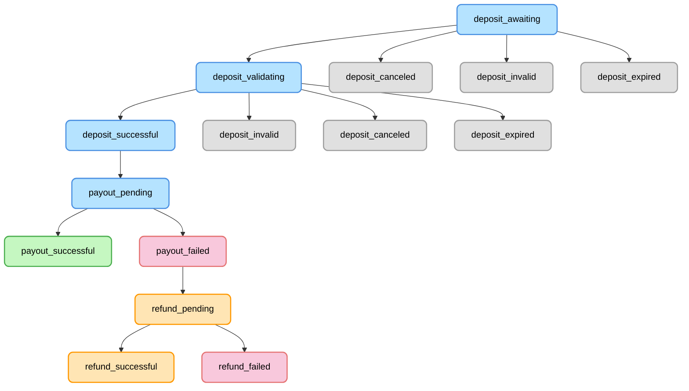

# Fonbnk merchant API V2 Documentation (WIP)

> Draft API V2 for Fonbnk merchants that unifies on-ramp/off-ramp into a single Deposit/Payout flow.

## Table of Contents

- [Fonbnk merchant API V2 Documentation (WIP)](#fonbnk-merchant-api-v2-documentation-wip)
  - [Table of Contents](#table-of-contents)
  - [Overview](#overview)
  - [Order flow overview](#order-flow-overview)
  - [KYC requirements](#kyc-requirements)
  - [Example Flows](#example-flows)
    - [Fiat-to-Merchant balance Example Flow](#fiat-to-merchant-balance-example-flow)
    - [Fiat-to-Crypto Example Flow](#fiat-to-crypto-example-flow)
    - [Crypto-to-Fiat Example Flow](#crypto-to-fiat-example-flow)
    - [Merchant balance-to-Fiat Example Flow](#merchant-balance-to-fiat-example-flow)
  - [Transfer types explanation](#transfer-types-explanation)
  - [Order statuses](#order-statuses)
  - [Authentication \& Request Signing](#authentication--request-signing)
  - [Webhooks](#webhooks)
    - [Webhook Verification](#webhook-verification)
    - [Webhook Response Requirements](#webhook-response-requirements)
    - [Retry Policy](#retry-policy)
  - [API endpoints](#api-endpoints)
    - [Get currencies](#get-currencies)
    - [Get order limits](#get-order-limits)
    - [Get quote](#get-quote)
    - [Create order](#create-order)
    - [Get user KYC state](#get-user-kyc-state)
    - [Submit user KYC](#submit-user-kyc)
    - [Trigger intermediate action](#trigger-intermediate-action)
    - [Confirm order](#confirm-order)
    - [Cancel order](#cancel-order)
    - [Get order](#get-order)
    - [Get orders](#get-orders)
    - [Get merchant balance](#get-merchant-balance)
  - [Types used in the above definitions:](#types-used-in-the-above-definitions)

## Overview

This is a draft API for V2 of the current Fonbnk API for merchants.

In the previous version we had a distinction between "onramp" and "offramp" endpoints with a separate set of endpoints
for each, different request and response formats, and different integrations for each. In this new version we unify the
concepts into a uniform API, and we now operate with the concepts
of "deposit" and "payout" instead of "onramp" and "offramp".

The merchant has the access to these currency types:

- Fiat (e.g., NGN, KES, GHS)
- Crypto (e.g., CELO_CUSD, TRON_USDT, POLYGON_USDT)
- Merchant Balance (currently USD)

Merchant can Create orders to deposit one currency type and payout another currency type. Examples:

- Deposit Fiat (NGN) via Bank Transfer, Payout Crypto (POLYGON_USDT)
- Deposit Crypto (CELO_CUSD) via Crypto Transfer, Payout fiat mobile money (KES)
- Deposit Merchant Balance (USD), Payout Crypto (TRON_USDT)
- Deposit Fiat (GHS) via Mobile Money, Payout Merchant Balance (USD)

With the new architecture, a merchant has access to:

- off-ramp
- on-ramp
- funding merchant balance from supported deposit methods
- withdrawing merchant balance to supported payout methods
- accepting crypto/fiat payments to merchant balance, then paying out via any supported method

## Order flow overview

1. Call [Get currencies](#get-currencies) to list supported currencies, channels, and pairs.
2. Call [Get order limits](#get-order-limits) for the selected deposit/payout configuration.
3. Call [Get user KYC state](#get-user-kyc-state) to determine if KYC is required for the intended amounts and currency
   types.
    - If KYC is required, call [Submit user KYC](#submit-user-kyc) and wait until status is approved.
  - See [KYC requirements](#kyc-requirements) for a detailed checklist of the decision flow.
4. Call [Get quote](#get-quote) with the deposit/payout configuration and one side’s amount (deposit.amount or
   payout.amount, not both).
    - Use deposit.fieldsToCreateOrder and payout.fieldsToCreateOrder to collect all required fields from the user.
5. Call [Create order](#create-order) with quoteId and the collected fields.
6. User completes the deposit per transfer instructions on the order.
7. If the transfer requires an intermediate action (stk_push / otp_stk_push),
   call [Trigger intermediate action](#trigger-intermediate-action).
8. If required, call [Confirm order](#confirm-order) to confirm the deposit.
9. Track order status as deposit validates and payout processes.
10. Use [Get order](#get-order) to poll for status and details at any time.

## KYC requirements

Most flows require validating a user’s Know Your Customer (KYC) level before creating an order. The high-level steps are:

1. Call [Get user KYC state](#get-user-kyc-state) with the user’s email and country.
2. Inspect the returned `kycRules` to see which KYC tier (`basic`, `advanced`, etc.) is required for the intended deposit or payout amounts and currency types.
3. If the user hasn’t already passed the needed tier (`passedKycType`), prompt them for the document listed in `kycDocuments` and gather the associated `requiredFields`.
4. Submit the collected data via [Submit user KYC](#submit-user-kyc). Continue polling `Get user KYC state` until `currentKycStatus` becomes `approved`.

> Tip: The sample data below shows that payouts ≥ 100 USD in crypto require `advanced` KYC. Your environment will return thresholds appropriate for the country, currency, and operation type.


<summary>Sample `Get user KYC state` response</summary>

```json
{
  "passedKycType": null,
  "reachedKycLimit": false,
  "currentKycStatus": null,
  "currentKycStatusDescription": null,
  "kycDocuments": [
    {
      "_id": "67da909b739fc481aa525c43",
      "type": "basic",
      "title": "Voter ID",
      "value": "VOTER_ID",
      "requiredFields": [
        { "key": "first_name", "type": "string", "label": "First Name", "required": true },
        { "key": "last_name", "type": "string", "label": "Last Name", "required": true },
        { "key": "dob", "type": "date", "label": "Date of birth", "required": true },
        {
          "key": "id_number",
          "type": "string",
          "label": "ID number",
          "required": true,
          "format": "0000000000000000000",
          "regexp": "^[a-zA-Z0-9 ]{9,29}$",
          "regexpFlags": "i"
        }
      ]
    },
    {
      "_id": "67da93c0dfd3a00f3380b857",
      "type": "advanced",
      "title": "Driving License",
      "value": "DRIVERS_LICENSE",
      "requiredFields": [
        { "key": "first_name", "type": "string", "label": "First Name", "required": true },
        { "key": "last_name", "type": "string", "label": "Last Name", "required": true },
        { "key": "dob", "type": "date", "label": "Date of birth", "required": true },
        { "key": "images", "type": "smile-identity-images", "label": "Verification images", "required": true }
      ]
    }
  ],
  "kycRules": [
    {
      "operationType": "deposit",
      "currencyType": "crypto",
      "min": 0,
      "max": 100,
      "type": "basic"
    },
    {
      "operationType": "payout",
      "currencyType": "crypto",
      "min": 100,
      "max": "Infinity",
      "type": "advanced"
    }
  ]
}
```


<summary>Sample `Submit user KYC` request</summary>

```json
{
  "userEmail": "someuser@example.com",
  "countryIsoCode": "NG",
  "documentId": "67da93c0dfd3a00f3380b857",
  "userFields": {
    "first_name": "John",
    "last_name": "Doe",
    "dob": "1990-01-01",
    "images": [
      { "image_type_id": 0, "image": "https://cdn.com/selfie.jpg" },
      { "image_type_id": 1, "image": "https://cdn.com/front.jpg" },
      { "image_type_id": 5, "image": "https://cdn.com/back.jpg" }
    ]
  }
}
```


Once the user’s KYC status is approved at or above the required tier, proceed with quoting and order creation. The following example flows reference this section instead of duplicating the steps.

## Example Flows

These walkthroughs build on the [Order flow overview](#order-flow-overview). Before collecting quotes, always confirm the customer meets the [KYC requirements](#kyc-requirements) for the intended amounts; each flow will call that out explicitly when thresholds matter.

### Fiat-to-Merchant balance Example Flow

Let’s do a NGN (fiat) deposit to merchant balance USD payout. First, call [Get currencies](#get-currencies) and assume
you receive:


<summary>Example response</summary>

```json
[
  {
    "currencyType": "fiat",
    "currencyCode": "NGN",
    "paymentChannels": [
      {
        "type": "bank",
        "transferTypes": [
          "manual",
          "redirect"
        ],
        "isDepositAllowed": true,
        "isPayoutAllowed": true
      },
      {
        "type": "airtime",
        "transferTypes": [
          "ussd"
        ],
        "carriers": [
          {
            "code": "MTN",
            "name": "MTN"
          },
          {
            "code": "AIRTEL",
            "name": "Airtel"
          },
          {
            "code": "GLO",
            "name": "Glo"
          },
          {
            "code": "9MOBILE",
            "name": "9Mobile"
          }
        ],
        "isDepositAllowed": true,
        "isPayoutAllowed": false
      },
      {
        "type": "mobile_money",
        "transferTypes": [
          "stk_push",
          "otp_stk_push"
        ],
        "carriers": [
          {
            "code": "MTN",
            "name": "MTN Mobile Money"
          },
          {
            "code": "AIRTEL",
            "name": "Airtel Money"
          },
          {
            "code": "GLO",
            "name": "Glo Mobile Money"
          },
          {
            "code": "9MOBILE",
            "name": "9Mobile Money"
          }
        ],
        "isDepositAllowed": true,
        "isPayoutAllowed": true
      }
    ],
    "currencyDetails": {
      "countryIsoCode": "NG",
      "countryName": "Nigeria",
      "countryCode": "234",
      "currencySymbol": "₦",
      "countryIcon": "https://cdn.example.com/flags/ng.png"
    },
    "pairs": [
      "crypto",
      "merchant_balance"
    ]
  },
  {
    "currencyType": "merchant_balance",
    "currencyCode": "USD",
    "paymentChannels": [
      {
        "type": "merchant_balance",
        "transferTypes": [
          "manual"
        ],
        "isDepositAllowed": true,
        "isPayoutAllowed": true
      }
    ],
    "currencyDetails": {
      "merchantName": "Fonbnk"
    },
    "pairs": [
      "fiat",
      "crypto"
    ]
  }
]
```


We see NGN supports deposit via bank/airtime/mobile money, and payout via bank/mobile money. Merchant balance supports both
deposit and payout. So we can do Fiat→Merchant balance USD.

Next, call [Get order limits](#get-order-limits) with:

- depositPaymentChannel: "bank"
- depositCurrencyType: "fiat"
- depositCurrencyCode: "NGN"
- depositCountryIsoCode: "NG"
- payoutPaymentChannel: "merchant_balance"
- payoutCurrencyType: "merchant_balance"
- payoutCurrencyCode: "USD"


<summary>Example response</summary>

```json
{
  "deposit": {
    "min": 1523,
    "max": 761469,
    "minUsd": 1,
    "maxUsd": 500
  },
  "payout": {
    "min": 1,
    "max": 500,
    "minUsd": 1,
    "maxUsd": 500
  }
}
```


We see that the minimum deposit is 1523 NGN and the maximum is 761469 NGN, which corresponds to 1-500 USD.

Assume the merchant wants to receive 100 USD. Check the user’s tier using the [KYC requirements](#kyc-requirements) flow before proceeding. In the sample sandbox rules, payouts of 100 USD or more trigger the `advanced` tier, so be sure the user has submitted and been approved for that document set.

Then [Get quote](#get-quote):


<summary>Example request</summary>

```json
{
  "deposit": {
    "paymentChannel": "bank",
    "currencyType": "fiat",
    "currencyCode": "NGN",
    "countryIsoCode": "NG"
  },
  "payout": {
    "paymentChannel": "merchant_balance",
    "currencyType": "merchant_balance",
    "currencyCode": "USD",
    "amount": 100
  }
}
```


<summary>Example response</summary>

```json
{
  "quoteId": "68e39d03ad6568cbcc6c2cfd",
  "quoteExpiresAt": "2025-10-06T10:52:11.864Z",
  "deposit": {
    "paymentChannel": "bank",
    "currencyType": "fiat",
    "currencyCode": "NGN",
    "currencyDetails": {
      "countryIsoCode": "NG",
      "countryName": "Nigeria",
      "countryCode": "234",
      "currencySymbol": "₦",
      "countryIcon": "https://storage.googleapis.com/fonbnk-public/countries%2FNG-b1cff1b62ee4e696def3d1b3d38181077a304c279c00b9c6bf06b971b1aab5e3.svg"
    },
    "cashout": {
      "amountBeforeFees": 152294,
      "amountAfterFees": 147726,
      "amountBeforeFeesUsd": 103.092909,
      "amountAfterFeesUsd": 100.000677,
      "chargedFees": [
        {
          "id": "provider_fee",
          "type": "percentage",
          "recipient": "provider",
          "amount": 761
        },
        {
          "id": "service_fee",
          "type": "percentage",
          "recipient": "platform",
          "amount": 3807
        }
      ],
      "chargedFeesUsd": [
        {
          "id": "provider_fee",
          "type": "percentage",
          "recipient": "provider",
          "amount": 0.515146
        },
        {
          "id": "service_fee",
          "type": "percentage",
          "recipient": "platform",
          "amount": 2.577086
        }
      ],
      "totalChargedFees": 4568,
      "totalChargedFeesUsd": 3.092232,
      "exchangeRate": 1477.25,
      "exchangeRateAfterFees": 1522.9297,
      "chargedFeesPerRecipient": {
        "provider": 761,
        "platform": 3807
      },
      "chargedFeesPerRecipientUsd": {
        "provider": 0.515146,
        "platform": 2.577086
      },
      "feeSettings": [
        {
          "id": "provider_fee",
          "type": "percentage",
          "value": 0.5,
          "min": 0,
          "max": "Infinity",
          "recipient": "provider"
        },
        {
          "id": "service_fee",
          "type": "percentage",
          "recipient": "platform",
          "value": 2.5,
          "min": 0,
          "max": "Infinity"
        }
      ]
    },
    "fieldsToCreateOrder": [
      {
        "key": "phoneNumber",
        "label": "Phone Number",
        "required": true,
        "type": "phone"
      },
      {
        "key": "bankCode",
        "label": "Bank name",
        "required": true,
        "type": "enum",
        "options": [
          {
            "label": "Sandbox Bank",
            "value": "1"
          },
          {
            "label": "Sandbox Bank 2",
            "value": "2"
          },
          {
            "label": "Sandbox Bank 3",
            "value": "3"
          }
        ]
      },
      {
        "key": "bankAccountNumber",
        "label": "Bank Account Number",
        "required": true,
        "type": "string"
      },
      {
        "key": "depositSandboxForcedFlow",
        "type": "enum",
        "label": "Sandbox deposit forced flow",
        "required": false,
        "defaultValue": "deposit_success",
        "options": [
          {
            "label": "Deposit success",
            "value": "deposit_success"
          },
          {
            "label": "Deposit invalid",
            "value": "deposit_invalid"
          },
          {
            "label": "Deposit underpayment (50%)",
            "value": "deposit_underpayment"
          },
          {
            "label": "Deposit overpayment (200%)",
            "value": "deposit_overpayment"
          }
        ]
      }
    ],
    "transferType": "manual"
  },
  "payout": {
    "paymentChannel": "merchant_balance",
    "currencyType": "merchant_balance",
    "currencyCode": "USD",
    "currencyDetails": {},
    "cashout": {
      "amountBeforeFees": 100,
      "amountAfterFees": 100,
      "amountBeforeFeesUsd": 100,
      "amountAfterFeesUsd": 100,
      "chargedFees": [],
      "chargedFeesUsd": [],
      "totalChargedFees": 0,
      "totalChargedFeesUsd": 0,
      "exchangeRate": 1,
      "exchangeRateAfterFees": 1,
      "chargedFeesPerRecipient": {},
      "chargedFeesPerRecipientUsd": {},
      "feeSettings": []
    },
    "fieldsToCreateOrder": [
      {
        "key": "payoutSandboxForcedFlow",
        "type": "enum",
        "label": "Sandbox payout forced flow",
        "defaultValue": "payout_success",
        "required": false,
        "options": [
          {
            "label": "Payout success",
            "value": "payout_success"
          },
          {
            "label": "Payout failed",
            "value": "payout_failed"
          }
        ]
      }
    ]
  }
}
```


For a merchant receive 100 USD, user must deposit 152294 NGN. Collect these fields:

- phoneNumber
- bankCode (from enum options)
- bankAccountNumber
- depositSandboxForcedFlow (sandbox optional field to simulate deposit success/failure/underpayment/overpayment)
- payoutSandboxForcedFlow (sandbox optional field to simulate payout success/failure)

> **Sandbox tip:** When you're testing in the sandbox environment you can set `depositSandboxForcedFlow` or `payoutSandboxForcedFlow` to force the platform to return success, failure, or other edge outcomes. This makes it easy to imitate failed flows without moving real funds.

Create the order via [Create order](#create-order):


<summary>Example request</summary>

```json
{
  "quoteId": "68e39d03ad6568cbcc6c2cfd",
  "userEmail": "someuser@example.com",
  "userIp": "174.3.2.22",
  "deposit": {
    "paymentChannel": "bank",
    "currencyType": "fiat",
    "currencyCode": "NGN",
    "countryIsoCode": "NG"
  },
  "payout": {
    "paymentChannel": "merchant_balance",
    "currencyType": "merchant_balance",
    "currencyCode": "USD",
    "amount": 100
  },
  "fieldsToCreateOrder": {
    "phoneNumber": "2348012345678",
    "bankCode": "1",
    "bankAccountNumber": "1234567890",
    "depositSandboxForcedFlow": "deposit_success",
    "payoutSandboxForcedFlow": "payout_success"
  }
}
```


<summary>Example response (transfer instructions excerpt)</summary>

```typescript
const response = {
  "quoteUsed": true,
  "order": {
    "_id": "68e39f49a6a8bf724e43de72",
    "countryIsoCode": "NG",
    "userId": "68e39f1af2846eee548917b2",
    "userEmail": "someuser@example.com",
    "status": "deposit_awaiting",
    "deposit": {
      "paymentChannel": "bank",
      "currencyType": "fiat",
      "currencyCode": "NGN",
      "currencyDetails": {
        "countryIsoCode": "NG",
        "countryName": "Nigeria",
        "countryCode": "234",
        "currencySymbol": "₦",
        "countryIcon": "https://storage.googleapis.com/fonbnk-public/countries%2FNG-b1cff1b62ee4e696def3d1b3d38181077a304c279c00b9c6bf06b971b1aab5e3.svg"
      },
      "cashout": {
        "amountBeforeFees": 152294,
        "amountAfterFees": 147726,
        "amountBeforeFeesUsd": 103.092909,
        "amountAfterFeesUsd": 100.000677,
        "chargedFees": [
          {
            "id": "provider_fee",
            "type": "percentage",
            "recipient": "provider",
            "amount": 761
          },
          {
            "id": "service_fee",
            "type": "percentage",
            "recipient": "platform",
            "amount": 3807
          }
        ],
        "chargedFeesUsd": [
          {
            "id": "provider_fee",
            "type": "percentage",
            "recipient": "provider",
            "amount": 0.515146
          },
          {
            "id": "service_fee",
            "type": "percentage",
            "recipient": "platform",
            "amount": 2.577086
          }
        ],
        "totalChargedFees": 4568,
        "totalChargedFeesUsd": 3.092232,
        "exchangeRate": 1477.25,
        "exchangeRateAfterFees": 1522.9297,
        "chargedFeesPerRecipient": {
          "provider": 761,
          "platform": 3807
        },
        "chargedFeesPerRecipientUsd": {
          "provider": 0.515146,
          "platform": 2.577086
        },
        "feeSettings": [
          {
            "id": "provider_fee",
            "type": "percentage",
            "value": 0.5,
            "min": 0,
            "max": "Infinity",
            "recipient": "provider"
          },
          {
            "id": "service_fee",
            "type": "percentage",
            "recipient": "platform",
            "value": 2.5,
            "min": 0,
            "max": "Infinity"
          }
        ]
      },
      "fieldsToCreateOrder": [
        {
          "key": "phoneNumber",
          "label": "Phone Number",
          "required": true,
          "type": "phone"
        },
        {
          "key": "bankCode",
          "label": "Bank name",
          "required": true,
          "type": "enum",
          "options": [
            {
              "label": "Sandbox Bank",
              "value": "1"
            },
            {
              "label": "Sandbox Bank 2",
              "value": "2"
            },
            {
              "label": "Sandbox Bank 3",
              "value": "3"
            }
          ]
        },
        {
          "key": "bankAccountNumber",
          "label": "Bank Account Number",
          "required": true,
          "type": "string"
        },
        {
          "key": "depositSandboxForcedFlow",
          "type": "enum",
          "label": "Sandbox deposit forced flow",
          "required": false,
          "defaultValue": "deposit_success",
          "options": [
            {
              "label": "Deposit success",
              "value": "deposit_success"
            },
            {
              "label": "Deposit invalid",
              "value": "deposit_invalid"
            },
            {
              "label": "Deposit underpayment (50%)",
              "value": "deposit_underpayment"
            },
            {
              "label": "Deposit overpayment (200%)",
              "value": "deposit_overpayment"
            }
          ]
        }
      ],
      "providedFieldsToCreateOrder": {
        "phoneNumber": "2348012345678",
        "bankCode": "1",
        "bankAccountNumber": "1234567890",
        "depositSandboxForcedFlow": "deposit_success"
      },
      "transferInstructions": {
        "type": "manual",
        "instructionsText": "It is a sandbox offer. If you are using test account, please confirm the transfer from your side and seller will automatically confirm the transfer from his side within 1 minute.",
        "warningText": "Created orders from non-test accounts will be automatically canceled after 5 minutes.",
        "transferDetails": [
          {
            "id": "recipientBankName",
            "label": "Bank name",
            "value": "Sandbox Bank"
          },
          {
            "id": "recipientBankAccountNumber",
            "label": "Bank account number",
            "value": "2202557239"
          },
          {
            "id": "recipientBankAccountName",
            "label": "Bank account name",
            "value": "SANDY BOXERRITTO"
          },
          {
            "id": "amountToSend",
            "label": "Amount to send",
            "value": "152294"
          }
        ],
        "fieldsToConfirmOrder": []
      }
    },
    "payout": {
      "paymentChannel": "merchant_balance",
      "currencyType": "merchant_balance",
      "currencyCode": "USD",
      "currencyDetails": {},
      "cashout": {
        "amountBeforeFees": 100,
        "amountAfterFees": 100,
        "amountBeforeFeesUsd": 100,
        "amountAfterFeesUsd": 100,
        "chargedFees": [],
        "chargedFeesUsd": [],
        "totalChargedFees": 0,
        "totalChargedFeesUsd": 0,
        "exchangeRate": 1,
        "exchangeRateAfterFees": 1,
        "chargedFeesPerRecipient": {},
        "chargedFeesPerRecipientUsd": {},
        "feeSettings": []
      },
      "fieldsToCreateOrder": [
        {
          "key": "payoutSandboxForcedFlow",
          "type": "enum",
          "label": "Sandbox payout forced flow",
          "defaultValue": "payout_success",
          "required": false,
          "options": [
            {
              "label": "Payout success",
              "value": "payout_success"
            },
            {
              "label": "Payout failed",
              "value": "payout_failed"
            }
          ]
        }
      ],
      "providedFieldsToCreateOrder": {
        "payoutSandboxForcedFlow": "payout_success"
      }
    },
    "statusChangeLogs": [],
    "createdAt": "2025-10-06T10:51:53.065Z",
    "updatedAt": "2025-10-06T10:51:53.065Z",
    "expiresAt": "2025-10-06T10:56:50.682Z"
  }
}
```


User makes the transfer with the exact amount and reference. Then call [Confirm order](#confirm-order) if no extra
fields are required:


<summary>Example request</summary>

```json
{
  "orderId": "68e39f49a6a8bf724e43de72"
}
```


The system validates the deposit and processes payout. Use [Get order](#get-order) to track status until "
payout_successful".

Let’s do a CELO cUSD deposit to merchant balance USD payout. First, call [Get currencies](#get-currencies) and assume
you receive:


<summary>Example response</summary>

```json
[
  {
    "currencyType": "crypto",
    "currencyCode": "CELO_CUSD",
    "paymentChannels": [
      {
        "type": "crypto",
        "transferTypes": [
          "manual"
        ],
        "isDepositAllowed": true,
        "isPayoutAllowed": true
      }
    ],
    "currencyDetails": {
      "network": "CELO",
      "asset": "CUSD",
      "networkIcon": "https://storage.googleapis.com/fonbnk-public/networks%2FCELO-18f981e8af97c118b571bb98d19f8fe7ab4cf558d01b373da4cd4bb45b9a35c2.svg",
      "assetIcon": "https://storage.googleapis.com/fonbnk-public/assets%2FCUSD-2b4b3fe89fb01ac46c814b08da63a5c238984f28817632dc5a0012c634914913.svg",
      "contractAddress": "0xd5cf8ab08295e32db2e2dce8478e5ce021340a57",
      "networkTitle": "Celo",
      "assetTitle": "cUSD",
      "decimals": 18,
      "priceUsd": 1,
      "transferNetworkFee": 0.0021125845,
      "transferNetworkFeeUsd": 0
    },
    "pairs": [
      "fiat",
      "merchant_balance"
    ]
  },
  {
    "currencyType": "merchant_balance",
    "currencyCode": "USD",
    "paymentChannels": [
      {
        "type": "merchant_balance",
        "transferTypes": [
          "manual"
        ],
        "isDepositAllowed": true,
        "isPayoutAllowed": true
      }
    ],
    "currencyDetails": {
      "merchantName": "Fonbnk"
    },
    "pairs": [
      "fiat",
      "crypto"
    ]
  }
]
```


We see CELO cUSD supports deposit and payout. Merchant balance supports both
deposit and payout. So we can do Crypto→Merchant balance USD.

Next, call [Get order limits](#get-order-limits) with:

- depositPaymentChannel: "crypto"
- depositCurrencyType: "crypto"
- depositCurrencyCode: "CELO_CUSD"
- payoutPaymentChannel: "merchant_balance"
- payoutCurrencyType: "merchant_balance"
- payoutCurrencyCode: "USD"


<summary>Example response</summary>

```json
{
  "deposit": {
    "min": 1,
    "max": 500,
    "minUsd": 1,
    "maxUsd": 500
  },
  "payout": {
    "min": 1,
    "max": 500,
    "minUsd": 1,
    "maxUsd": 500
  }
}

```


We see that the minimum deposit is 1 CELO cUSD and the maximum is 500 CELO cUSD.

Assume the merchant wants to receive 100 USD. Reuse the [KYC requirements](#kyc-requirements) checklist to confirm the customer has passed the appropriate tier. With the example rules, this amount again requires the `advanced` document set before you continue.

Then [Get quote](#get-quote):


<summary>Example request</summary>

```json
{
  "deposit": {
    "paymentChannel": "crypto",
    "currencyType": "crypto",
    "currencyCode": "CELO_CUSD"
  },
  "payout": {
    "paymentChannel": "merchant_balance",
    "currencyType": "merchant_balance",
    "currencyCode": "USD",
    "amount": 100
  }
}
```


<summary>Example response</summary>

```json
{
  "quoteId": "68e3b5d49c482e95188bfbc4",
  "quoteExpiresAt": "2025-10-06T12:38:04.163Z",
  "deposit": {
    "paymentChannel": "crypto",
    "currencyType": "crypto",
    "currencyCode": "CELO_CUSD",
    "currencyDetails": {
      "network": "CELO",
      "asset": "CUSD",
      "networkIcon": "https://storage.googleapis.com/fonbnk-public/networks%2FCELO-18f981e8af97c118b571bb98d19f8fe7ab4cf558d01b373da4cd4bb45b9a35c2.svg",
      "assetIcon": "https://storage.googleapis.com/fonbnk-public/assets%2FCUSD-2b4b3fe89fb01ac46c814b08da63a5c238984f28817632dc5a0012c634914913.svg",
      "contractAddress": "0xd5cf8ab08295e32db2e2dce8478e5ce021340a57",
      "networkTitle": "Celo",
      "assetTitle": "cUSD",
      "decimals": 18,
      "priceUsd": 1,
      "transferNetworkFee": 0.0021125845,
      "transferNetworkFeeUsd": 0,
      "systemWalletAddress": "0x0f002dcfde0f7ba4088341186f48fb8592e50695",
      "systemWalletId": "6893465b6fe2c7be26afc241"
    },
    "cashout": {
      "amountBeforeFees": 100,
      "amountAfterFees": 100,
      "amountBeforeFeesUsd": 100,
      "amountAfterFeesUsd": 100,
      "chargedFees": [],
      "chargedFeesUsd": [],
      "totalChargedFees": 0,
      "totalChargedFeesUsd": 0,
      "exchangeRate": 1,
      "exchangeRateAfterFees": 1,
      "chargedFeesPerRecipient": {},
      "chargedFeesPerRecipientUsd": {},
      "feeSettings": []
    },
    "fieldsToCreateOrder": [
      {
        "key": "blockchainWalletAddress",
        "type": "string",
        "label": "Your wallet address",
        "required": true
      },
      {
        "key": "depositSandboxForcedFlow",
        "type": "enum",
        "label": "Sandbox deposit forced flow",
        "required": false,
        "defaultValue": "deposit_success",
        "options": [
          {
            "label": "Deposit success",
            "value": "deposit_success"
          },
          {
            "label": "Deposit invalid",
            "value": "deposit_invalid"
          }
        ]
      }
    ],
    "transferType": "manual"
  },
  "payout": {
    "paymentChannel": "merchant_balance",
    "currencyType": "merchant_balance",
    "currencyCode": "USD",
    "currencyDetails": {},
    "cashout": {
      "amountBeforeFees": 100,
      "amountAfterFees": 100,
      "amountBeforeFeesUsd": 100,
      "amountAfterFeesUsd": 100,
      "chargedFees": [],
      "chargedFeesUsd": [],
      "totalChargedFees": 0,
      "totalChargedFeesUsd": 0,
      "exchangeRate": 1,
      "exchangeRateAfterFees": 1,
      "chargedFeesPerRecipient": {},
      "chargedFeesPerRecipientUsd": {},
      "feeSettings": []
    },
    "fieldsToCreateOrder": [
      {
        "key": "payoutSandboxForcedFlow",
        "type": "enum",
        "label": "Sandbox payout forced flow",
        "defaultValue": "payout_success",
        "required": false,
        "options": [
          {
            "label": "Payout success",
            "value": "payout_success"
          },
          {
            "label": "Payout failed",
            "value": "payout_failed"
          }
        ]
      }
    ]
  }
}
```


For a merchant receive 100 USD, user must deposit 100 CELO cUSD. Collect these fields:

- blockchainWalletAddress (user's wallet to send crypto from)
- depositSandboxForcedFlow (sandbox optional field to simulate deposit success/failure/underpayment/overpayment)
- payoutSandboxForcedFlow (sandbox optional field to simulate payout success/failure)

Create the order via [Create order](#create-order):


<summary>Example request</summary>

```json
{
  "quoteId": "68e3b5d49c482e95188bfbc4",
  "userEmail": "someuser@example.com",
  "userIp": "174.3.2.22",
  "deposit": {
    "paymentChannel": "crypto",
    "currencyType": "crypto",
    "currencyCode": "CELO_CUSD"
  },
  "payout": {
    "paymentChannel": "merchant_balance",
    "currencyType": "merchant_balance",
    "currencyCode": "USD",
    "amount": 100
  },
  "fieldsToCreateOrder": {
    "blockchainWalletAddress": "0x5b7ae4c6c89F4A3F84b35c77233b13194eBFAD25",
    "depositSandboxForcedFlow": "deposit_success",
    "payoutSandboxForcedFlow": "payout_success"
  }
}
```


<summary>Example response (transfer instructions excerpt)</summary>

```typescript
const response = {
  "quoteUsed": false,
  "order": {
    "_id": "68e3b83f3159cf93e75dbbe2",
    "countryIsoCode": "NG",
    "userId": "68e39f1af2846eee548917b2",
    "userEmail": "someuser@example.com",
    "status": "deposit_awaiting",
    "deposit": {
      "paymentChannel": "crypto",
      "currencyType": "crypto",
      "currencyCode": "CELO_CUSD",
      "currencyDetails": {
        "network": "CELO",
        "asset": "CUSD",
        "networkIcon": "https://storage.googleapis.com/fonbnk-public/networks%2FCELO-18f981e8af97c118b571bb98d19f8fe7ab4cf558d01b373da4cd4bb45b9a35c2.svg",
        "assetIcon": "https://storage.googleapis.com/fonbnk-public/assets%2FCUSD-2b4b3fe89fb01ac46c814b08da63a5c238984f28817632dc5a0012c634914913.svg",
        "contractAddress": "0xd5cf8ab08295e32db2e2dce8478e5ce021340a57",
        "networkTitle": "Celo",
        "assetTitle": "cUSD",
        "decimals": 18,
        "priceUsd": 1,
        "transferNetworkFee": 0.0021125845,
        "transferNetworkFeeUsd": 0,
        "systemWalletAddress": "0x0f002dcfde0f7ba4088341186f48fb8592e50695",
        "systemWalletId": "6893465b6fe2c7be26afc241"
      },
      "cashout": {
        "amountBeforeFees": 100,
        "amountAfterFees": 100,
        "amountBeforeFeesUsd": 100,
        "amountAfterFeesUsd": 100,
        "chargedFees": [],
        "chargedFeesUsd": [],
        "totalChargedFees": 0,
        "totalChargedFeesUsd": 0,
        "exchangeRate": 1,
        "exchangeRateAfterFees": 1,
        "chargedFeesPerRecipient": {},
        "chargedFeesPerRecipientUsd": {},
        "feeSettings": []
      },
      "fieldsToCreateOrder": [
        {
          "key": "blockchainWalletAddress",
          "type": "string",
          "label": "Your wallet address",
          "required": true
        },
        {
          "key": "depositSandboxForcedFlow",
          "type": "enum",
          "label": "Sandbox deposit forced flow",
          "required": false,
          "defaultValue": "deposit_success",
          "options": [
            {
              "label": "Deposit success",
              "value": "deposit_success"
            },
            {
              "label": "Deposit invalid",
              "value": "deposit_invalid"
            }
          ]
        }
      ],
      "providedFieldsToCreateOrder": {
        "blockchainWalletAddress": "0x91b0a33dbcb10f8331eD3627B94e5a9B1591269f",
        "depositSandboxForcedFlow": "deposit_success"
      },
      "transferInstructions": {
        "type": "manual",
        "instructionsText": "Please send the exact amount of crypto to the address below. Make sure to send only CUSD on the CELO network. Sending any other assets or using a different network may result in loss of funds.",
        "transferDetails": [
          {
            "id": "recipientWalletAddress",
            "label": "Wallet address to send",
            "value": "0x0f002dcfde0f7ba4088341186f48fb8592e50695"
          },
          {
            "id": "senderWalletAddress",
            "label": "Your wallet address",
            "value": "0x91b0a33dbcb10f8331eD3627B94e5a9B1591269f"
          },
          {
            "id": "amountToSend",
            "label": "Amount to send",
            "value": "100"
          }
        ],
        "fieldsToConfirmOrder": [
          {
            "key": "blockchainTransactionHash",
            "type": "string",
            "label": "Transaction hash",
            "required": true
          }
        ]
      }
    },
    "payout": {
      "paymentChannel": "merchant_balance",
      "currencyType": "merchant_balance",
      "currencyCode": "USD",
      "currencyDetails": {},
      "cashout": {
        "amountBeforeFees": 100,
        "amountAfterFees": 100,
        "amountBeforeFeesUsd": 100,
        "amountAfterFeesUsd": 100,
        "chargedFees": [],
        "chargedFeesUsd": [],
        "totalChargedFees": 0,
        "totalChargedFeesUsd": 0,
        "exchangeRate": 1,
        "exchangeRateAfterFees": 1,
        "chargedFeesPerRecipient": {},
        "chargedFeesPerRecipientUsd": {},
        "feeSettings": []
      },
      "fieldsToCreateOrder": [
        {
          "key": "payoutSandboxForcedFlow",
          "type": "enum",
          "label": "Sandbox payout forced flow",
          "defaultValue": "payout_success",
          "required": false,
          "options": [
            {
              "label": "Payout success",
              "value": "payout_success"
            },
            {
              "label": "Payout failed",
              "value": "payout_failed"
            },
          ]
        }
      ],
      "providedFieldsToCreateOrder": {
        "payoutSandboxForcedFlow": "payout_success"
      }
    },
    "statusChangeLogs": [],
    "createdAt": "2025-10-06T12:38:23.499Z",
    "updatedAt": "2025-10-06T12:38:23.499Z",
    "expiresAt": "2025-10-06T13:08:21.161Z"
  }
}

```


User makes a crypto transfer to the wallet address from the order.deposit.transferInstructions("recipientWalletAddress") - which is 0x0f002dcfde0f7ba4088341186f48fb8592e50695 for this order and provides with a transaction hash. 
Then call [Confirm order](#confirm-order) with the transaction hash:


<summary>Example request</summary>

```json
{
  "orderId": "68e39f49a6a8bf724e43de72",
  "fieldsToConfirmOrder": {
    "blockchainTransactionHash": "0xabc123def456ghi789jkl012mno345pqr678stu901vwx234yz567abc890def1"
  }
}
```


The system validates the deposit and processes payout. Use [Get order](#get-order) to track status until "
payout_successful".

### Fiat-to-Crypto Example Flow

Let’s do a NGN (fiat) deposit to POLYGON_USDT (crypto) payout. First, call [Get currencies](#get-currencies) and assume
you receive:


<summary>Example response</summary>

```json
[
  {
    "currencyType": "fiat",
    "currencyCode": "NGN",
    "paymentChannels": [
      {
        "type": "bank",
        "transferTypes": [
          "manual",
          "redirect"
        ],
        "isDepositAllowed": true,
        "isPayoutAllowed": true
      },
      {
        "type": "airtime",
        "transferTypes": [
          "ussd"
        ],
        "carriers": [
          {
            "code": "MTN",
            "name": "MTN"
          },
          {
            "code": "AIRTEL",
            "name": "Airtel"
          },
          {
            "code": "GLO",
            "name": "Glo"
          },
          {
            "code": "9MOBILE",
            "name": "9Mobile"
          }
        ],
        "isDepositAllowed": true,
        "isPayoutAllowed": false
      },
      {
        "type": "mobile_money",
        "transferTypes": [
          "stk_push",
          "otp_stk_push"
        ],
        "carriers": [
          {
            "code": "MTN",
            "name": "MTN Mobile Money"
          },
          {
            "code": "AIRTEL",
            "name": "Airtel Money"
          },
          {
            "code": "GLO",
            "name": "Glo Mobile Money"
          },
          {
            "code": "9MOBILE",
            "name": "9Mobile Money"
          }
        ],
        "isDepositAllowed": true,
        "isPayoutAllowed": true
      }
    ],
    "currencyDetails": {
      "countryIsoCode": "NG",
      "countryName": "Nigeria",
      "countryCode": "234",
      "currencySymbol": "₦",
      "countryIcon": "https://cdn.example.com/flags/ng.png"
    },
    "pairs": [
      "crypto",
      "merchant_balance"
    ]
  },
  {
    "currencyType": "crypto",
    "currencyCode": "POLYGON_USDT",
    "paymentChannels": [
      {
        "type": "crypto",
        "transferTypes": [
          "manual"
        ],
        "isDepositAllowed": true,
        "isPayoutAllowed": true
      }
    ],
    "currencyDetails": {
      "network": "POLYGON",
      "asset": "USDT",
      "networkTitle": "Polygon",
      "assetTitle": "USDT",
      "contractAddress": "0xc2132D05D31c914a87C6611C10748AEb04B58e8F",
      "decimals": 6,
      "networkIcon": "https://cdn.example.com/networks/polygon.png",
      "assetIcon": "https://cdn.example.com/assets/usdt.png"
    },
    "pairs": [
      "fiat",
      "merchant_balance"
    ]
  }
]
```


We see NGN supports deposit via bank/airtime/mobile money, and payout via bank/mobile money. POLYGON_USDT supports both
deposit and payout. So we can do Fiat→Crypto (NGN→POLYGON_USDT).

Next, call [Get order limits](#get-order-limits) with:

- depositPaymentChannel: "bank"
- depositCurrencyType: "fiat"
- depositCurrencyCode: "NGN"
- depositCountryIsoCode: "NG"
- payoutPaymentChannel: "crypto"
- payoutCurrencyType: "crypto"
- payoutCurrencyCode: "POLYGON_USDT"


<summary>Example response</summary>

```json
{
  "deposit": {
    "min": 1556,
    "max": 311184,
    "minUsd": 1,
    "maxUsd": 200
  },
  "payout": {
    "min": 1,
    "max": 200,
    "minUsd": 1,
    "maxUsd": 200
  }
}
```


Assume the user wants to receive 100 POLYGON_USDT. Validate their tier using the [KYC requirements](#kyc-requirements) flow. With the sample thresholds, that amount once more requires `advanced` KYC approval before quoting.

Then [Get quote](#get-quote):


<summary>Example request</summary>

```json
{
  "deposit": {
    "paymentChannel": "bank",
    "currencyType": "fiat",
    "currencyCode": "NGN",
    "countryIsoCode": "NG"
  },
  "payout": {
    "paymentChannel": "crypto",
    "currencyType": "crypto",
    "currencyCode": "POLYGON_USDT",
    "amount": 100
  }
}
```


<summary>Example response</summary>

```json
{
  "quoteId": "68628fa56ff494df5f39faf5",
  "quoteExpiresAt": "2024-10-10T10:10:10.000Z",
  "deposit": {
    "paymentChannel": "bank",
    "currencyType": "fiat",
    "currencyCode": "NGN",
    "currencyDetails": {
      "countryIsoCode": "NG",
      "countryName": "Nigeria",
      "countryCode": "234",
      "currencySymbol": "₦",
      "currencyIcon": "https://cdn.example.com/flags/ng.png"
    },
    "cashout": {
      "exchangeRate": 1500,
      "exchangeRateAfterFees": 1531.1269,
      "amountBeforeFees": 153128,
      "amountAfterFees": 150015,
      "amountBeforeFeesUsd": 102.085333,
      "amountAfterFeesUsd": 100.01,
      "chargedFees": [
        {
          "id": "provider_fee",
          "type": "flat_amount",
          "recipient": "provider",
          "amount": 50
        },
        {
          "id": "platform_fee",
          "type": "percentage",
          "recipient": "platform",
          "amount": 3063
        }
      ],
      "chargedFeesUsd": [
        {
          "id": "provider_fee",
          "type": "flat_amount",
          "recipient": "provider",
          "amount": 0.033333
        },
        {
          "id": "platform_fee",
          "type": "percentage",
          "recipient": "platform",
          "amount": 2.042
        }
      ],
      "totalChargedFees": 3113,
      "totalChargedFeesUsd": 2.075333,
      "chargedFeesPerRecipient": {
        "provider": 50,
        "platform": 3063
      },
      "chargedFeesPerRecipientUsd": {
        "provider": 0.033333,
        "platform": 2.042
      },
      "feeSettings": [
        {
          "id": "provider_fee",
          "recipient": "provider",
          "type": "flat_amount",
          "value": 50,
          "min": 0,
          "max": "Infinity"
        },
        {
          "id": "platform_fee",
          "recipient": "platform",
          "type": "percentage",
          "value": 2,
          "min": 0,
          "max": "Infinity"
        }
      ]
    },
    "fieldsToCreateOrder": [
      {
        "key": "phoneNumber",
        "label": "Phone Number",
        "required": true,
        "type": "phone"
      },
      {
        "key": "bankCode",
        "label": "Bank name",
        "required": true,
        "type": "enum",
        "options": [
          {
            "value": "120001:02",
            "label": "9Payment Service Bank"
          },
          {
            "value": "801:02",
            "label": "Abbey Mortgage Bank"
          }
        ]
      },
      {
        "key": "bankAccountNumber",
        "label": "Bank Account Number",
        "required": true,
        "type": "string"
      }
    ],
    "transferType": "manual"
  },
  "payout": {
    "paymentChannel": "crypto",
    "currencyType": "crypto",
    "currencyCode": "POLYGON_USDT",
    "currencyDetails": {
      "network": "POLYGON",
      "asset": "USDT",
      "networkTitle": "Polygon",
      "assetTitle": "USDT",
      "contractAddress": "0xc2132D05D31c914a87C6611C10748AEb04B58e8F",
      "decimals": 6,
      "networkIcon": "https://cdn.example.com/networks/polygon.png",
      "assetIcon": "https://cdn.example.com/assets/usdt.png"
    },
    "cashout": {
      "exchangeRate": 1,
      "exchangeRateAfterFees": 1.001,
      "amountBeforeFees": 100.01,
      "amountAfterFees": 100,
      "amountBeforeFeesUsd": 100.01,
      "amountAfterFeesUsd": 100,
      "feeSettings": [
        {
          "id": "gas_fee",
          "recipient": "blockchain",
          "type": "flat_amount",
          "value": 0.01,
          "min": 0,
          "max": "Infinity"
        }
      ],
      "chargedFees": [
        {
          "id": "gas_fee",
          "type": "flat_amount",
          "recipient": "blockchain",
          "amount": 0.01
        }
      ],
      "chargedFeesUsd": [
        {
          "id": "gas_fee",
          "type": "flat_amount",
          "recipient": "blockchain",
          "amount": 0.01
        }
      ],
      "totalChargedFees": 0.01,
      "totalChargedFeesUsd": 0.01,
      "chargedFeesPerRecipient": {
        "blockchain": 0.01
      },
      "chargedFeesPerRecipientUsd": {
        "blockchain": 0.01
      }
    },
    "fieldsToCreateOrder": [
      {
        "key": "blockchainWalletAddress",
        "label": "Your wallet address",
        "required": true,
        "type": "string"
      }
    ]
  }
}
```


To receive 100 POLYGON_USDT, user must deposit 153128 NGN. Collect these fields:

- phoneNumber
- bankCode (from enum options)
- bankAccountNumber
- blockchainWalletAddress

Create the order via [Create order](#create-order):


<summary>Example request</summary>

```json
{
  "quoteId": "68628fa56ff494df5f39faf5",
  "userEmail": "someuser@example.com",
  "userIp": "174.3.2.22",
  "deposit": {
    "paymentChannel": "bank",
    "currencyType": "fiat",
    "currencyCode": "NGN",
    "countryIsoCode": "NG"
  },
  "payout": {
    "paymentChannel": "crypto",
    "currencyType": "crypto",
    "currencyCode": "POLYGON_USDT",
    "amount": 100
  },
  "fieldsToCreateOrder": {
    "phoneNumber": "2348012345678",
    "bankCode": "120001:02",
    "bankAccountNumber": "1234567890",
    "blockchainWalletAddress": "0x5b7ae3c6c83F4A3F94b35c77233b13191eBGAD21"
  }
}
```


<summary>Example response (transfer instructions excerpt)</summary>

```typescript
const response = {
  "order": {
    "_id": "68728fa56ff494df5f39faf5",
    "countryIsoCode": "NG",
    "userId": "57a28fa56ff494df5f39faf5",
    "userEmail": "someuser@example.com",
    "status": "deposit_awaiting",
    "deposit": {
      //...
      transferInstructions: {
        type: "manual",
        instructionsText: "Please use the following bank details to make a transfer...",
        warningText: "Make sure to include the reference code in your transfer.",
        transferDetails: [
          {id: "recipientBankName", label: "Bank Name", value: "9Payment Service Bank"},
          {id: "recipientBankAccountNumber", label: "Account Number", value: "1234567890"},
          {id: "recipientBankAccountName", label: "Account Name", value: "Example Company Ltd"},
          {id: "amountToSend", label: "Amount to Send", value: "153128"},
          {
            id: "bankTransferNarration",
            label: "Transfer Narration / Reference",
            value: "ORDER-5F8D0D55B54764421B7156C5",
            description: "Use this as the transfer reference."
          }
        ],
        fieldsToConfirmOrder: [],
      }
    },
    "payout": {
      //...
    }
  }
}
```


User makes the transfer with the exact amount and reference. Then call [Confirm order](#confirm-order) if no extra
fields are required:


<summary>Example request</summary>

```json
{
  "orderId": "68728fa56ff494df5f39faf5"
}
```


The system validates the deposit and processes payout. Use [Get order](#get-order) to track status until "
payout_successful".

### Crypto-to-Fiat Example Flow

The flow is similar for fiat-to-crypto. The only difference is that when you confirm the order, you need to provide the
transaction hash of the crypto deposit transaction in fieldsToConfirmOrder.

### Merchant balance-to-Fiat Example Flow

Let’s do a merchant balance USD deposit to NGN bank payout. First, call [Get currencies](#get-currencies) and assume
you receive:


<summary>Example response</summary>

```json
[
  {
    "currencyType": "fiat",
    "currencyCode": "NGN",
    "paymentChannels": [
      {
        "type": "bank",
        "transferTypes": [
          "manual",
          "redirect"
        ],
        "isDepositAllowed": true,
        "isPayoutAllowed": true
      },
      {
        "type": "airtime",
        "transferTypes": [
          "ussd"
        ],
        "carriers": [
          {
            "code": "MTN",
            "name": "MTN"
          },
          {
            "code": "AIRTEL",
            "name": "Airtel"
          },
          {
            "code": "GLO",
            "name": "Glo"
          },
          {
            "code": "9MOBILE",
            "name": "9Mobile"
          }
        ],
        "isDepositAllowed": true,
        "isPayoutAllowed": false
      },
      {
        "type": "mobile_money",
        "transferTypes": [
          "stk_push",
          "otp_stk_push"
        ],
        "carriers": [
          {
            "code": "MTN",
            "name": "MTN Mobile Money"
          },
          {
            "code": "AIRTEL",
            "name": "Airtel Money"
          },
          {
            "code": "GLO",
            "name": "Glo Mobile Money"
          },
          {
            "code": "9MOBILE",
            "name": "9Mobile Money"
          }
        ],
        "isDepositAllowed": true,
        "isPayoutAllowed": true
      }
    ],
    "currencyDetails": {
      "countryIsoCode": "NG",
      "countryName": "Nigeria",
      "countryCode": "234",
      "currencySymbol": "₦",
      "countryIcon": "https://cdn.example.com/flags/ng.png"
    },
    "pairs": [
      "crypto",
      "merchant_balance"
    ]
  },
  {
    "currencyType": "merchant_balance",
    "currencyCode": "USD",
    "paymentChannels": [
      {
        "type": "merchant_balance",
        "transferTypes": [
          "manual"
        ],
        "isDepositAllowed": true,
        "isPayoutAllowed": true
      }
    ],
    "currencyDetails": {
      "merchantName": "Fonbnk"
    },
    "pairs": [
      "fiat",
      "crypto"
    ]
  }
]
```


We see CELO cUSD supports deposit and payout. Merchant balance supports both
deposit and payout. So we can do Fiat→Merchant balance USD.

Next, call [Get order limits](#get-order-limits) with:

- depositPaymentChannel: "merchant_balance"
- depositCurrencyType: "merchant_balance"
- depositCurrencyCode: "USD"
- payoutPaymentChannel: "bank"
- payoutCurrencyType: "fiat"
- payoutCurrencyCode: "NGN"


<summary>Example response</summary>

```json
{
  "deposit": {
    "min": 1,
    "max": 500,
    "minUsd": 1,
    "maxUsd": 500
  },
  "payout": {
    "min": 1426,
    "max": 738080,
    "minUsd": 1,
    "maxUsd": 500
  }
}

```


We see that the minimum deposit is 1 USD and the maximum is 500 USD, a user can receive from 1426 NGN to 738080 NGN.

Assume the merchant wants to send 100 USD. Reuse the [KYC requirements](#kyc-requirements) checklist to confirm the customer has passed the appropriate tier. With the example rules, this amount again requires the `advanced` document set before you continue.

Then [Get quote](#get-quote):


<summary>Example request</summary>

```json
{
  "deposit": {
    "paymentChannel": "merchant_balance",
    "currencyType": "merchant_balance",
    "currencyCode": "USD"
    "amount": 100
  },
  "payout": {
    "paymentChannel": "bank",
    "currencyType": "fiat",
    "currencyCode": "NGN",
  }
}
```


<summary>Example response</summary>

```json

{
  "quoteId": "68e8c0cc757967d6c4fb9f13",
  "quoteExpiresAt": "2025-10-10T08:26:12.765Z",
  "deposit": {
    "paymentChannel": "merchant_balance",
    "currencyType": "merchant_balance",
    "currencyCode": "USD",
    "currencyDetails": {
      "merchantName": "Bohdan another"
    },
    "cashout": {
      "amountBeforeFees": 100,
      "amountAfterFees": 100,
      "chargedFees": [],
      "totalChargedFees": 0,
      "chargedFeesPerRecipient": {},
      "amountBeforeFeesUsd": 100,
      "amountAfterFeesUsd": 100,
      "chargedFeesUsd": [],
      "totalChargedFeesUsd": 0,
      "exchangeRate": 1,
      "exchangeRateAfterFees": 1,
      "chargedFeesPerRecipientUsd": {},
      "feeSettings": []
    },
    "fieldsToCreateOrder": [
      {
        "key": "depositSandboxForcedFlow",
        "type": "enum",
        "label": "Sandbox deposit forced flow",
        "required": false,
        "defaultValue": "deposit_success",
        "options": [
          {
            "label": "Deposit success",
            "value": "deposit_success"
          },
          {
            "label": "Deposit invalid",
            "value": "deposit_invalid"
          },
          {
            "label": "Deposit underpayment (50%)",
            "value": "deposit_underpayment"
          },
          {
            "label": "Deposit overpayment (200%)",
            "value": "deposit_overpayment"
          }
        ]
      }
    ],
    "transferType": "manual"
  },
  "payout": {
    "paymentChannel": "bank",
    "currencyType": "fiat",
    "currencyCode": "NGN",
    "currencyDetails": {
      "countryIsoCode": "NG",
      "countryName": "Nigeria",
      "countryCode": "234",
      "currencySymbol": "₦",
      "countryIcon": "https://storage.googleapis.com/fonbnk-public/countries%2FNG-b1cff1b62ee4e696def3d1b3d38181077a304c279c00b9c6bf06b971b1aab5e3.svg"
    },
    "cashout": {
      "amountBeforeFees": 147626,
      "amountAfterFees": 147576,
      "chargedFees": [
        {
          "id": "provider_fee",
          "type": "flat_amount",
          "recipient": "provider",
          "amount": 50
        }
      ],
      "totalChargedFees": 50,
      "chargedFeesPerRecipient": {
        "provider": 50
      },
      "amountBeforeFeesUsd": 100,
      "amountAfterFeesUsd": 99.966131,
      "chargedFeesUsd": [
        {
          "id": "provider_fee",
          "type": "flat_amount",
          "recipient": "provider",
          "amount": 0.033869
        }
      ],
      "totalChargedFeesUsd": 0.033869,
      "exchangeRate": 1476.26,
      "exchangeRateAfterFees": 1476.7602,
      "chargedFeesPerRecipientUsd": {
        "provider": 0.033869
      },
      "feeSettings": [
        {
          "id": "provider_fee",
          "type": "flat_amount",
          "value": 50,
          "min": 0,
          "max": "Infinity",
          "recipient": "provider"
        }
      ]
    },
    "fieldsToCreateOrder": [
      {
        "key": "phoneNumber",
        "label": "Phone Number",
        "required": true,
        "type": "phone"
      },
      {
        "key": "bankCode",
        "label": "Bank name",
        "required": true,
        "type": "enum",
        "options": [
          {
            "label": "Sandbox Bank",
            "value": "1"
          },
          {
            "label": "Sandbox Bank 2",
            "value": "2"
          },
          {
            "label": "Sandbox Bank 3",
            "value": "3"
          }
        ]
      },
      {
        "key": "bankAccountNumber",
        "label": "Bank Account Number",
        "required": true,
        "type": "string"
      },
      {
        "key": "payoutSandboxForcedFlow",
        "type": "enum",
        "label": "Sandbox payout forced flow",
        "required": false,
        "defaultValue": "payout_success",
        "options": [
          {
            "label": "Payout success",
            "value": "payout_success"
          },
          {
            "label": "Payout failed",
            "value": "payout_failed"
          }
        ]
      }
    ]
  }
}

```


A user will receive 147576 NGN for 100 USD of merchant balance. Collect these fields:

- phoneNumber 
- bankCode
- bankAccountNumber 
- depositSandboxForcedFlow (sandbox optional field to simulate deposit success/failure/underpayment/overpayment)
- payoutSandboxForcedFlow (sandbox optional field to simulate payout success/failure)

Create the order via [Create order](#create-order):


<summary>Example request</summary>

```json
{
  "quoteId": "68e8c0cc757967d6c4fb9f13",
  "userEmail": "someuser@example.com",
  "userIp": "174.3.2.22",
  "deposit": {
    "paymentChannel": "merchant_balance",
    "currencyType": "merchant_balance",
    "currencyCode": "USD",
    "amount": 100
  },
  "payout": {
    "paymentChannel": "bank",
    "currencyType": "fiat",
    "currencyCode": "NGN"
  },
  "fieldsToCreateOrder": {
    "phoneNumber": "2348012345678",
    "bankAccountNumber": "1234567890",
    "bankCode": "1"
  }
}
```


<summary>Example response </summary>

```json
{
  "quoteUsed": true,
  "order": {
    "_id": "68e8c267fe37bec4801dd098",
    "countryIsoCode": "NG",
    "userId": "68e39f1af2846eee548917b2",
    "userEmail": "someuser@example.com",
    "status": "deposit_awaiting",
    "deposit": {
      "paymentChannel": "merchant_balance",
      "currencyType": "merchant_balance",
      "currencyCode": "USD",
      "currencyDetails": {
        "merchantName": "Bohdan another"
      },
      "cashout": {
        "amountBeforeFees": 100,
        "amountAfterFees": 100,
        "chargedFees": [],
        "totalChargedFees": 0,
        "chargedFeesPerRecipient": {},
        "amountBeforeFeesUsd": 100,
        "amountAfterFeesUsd": 100,
        "chargedFeesUsd": [],
        "totalChargedFeesUsd": 0,
        "exchangeRate": 1,
        "exchangeRateAfterFees": 1,
        "chargedFeesPerRecipientUsd": {},
        "feeSettings": []
      },
      "fieldsToCreateOrder": [
        {
          "key": "depositSandboxForcedFlow",
          "type": "enum",
          "label": "Sandbox deposit forced flow",
          "required": false,
          "defaultValue": "deposit_success",
          "options": [
            {
              "label": "Deposit success",
              "value": "deposit_success"
            },
            {
              "label": "Deposit invalid",
              "value": "deposit_invalid"
            },
            {
              "label": "Deposit underpayment (50%)",
              "value": "deposit_underpayment"
            },
            {
              "label": "Deposit overpayment (200%)",
              "value": "deposit_overpayment"
            }
          ]
        }
      ],
      "providedFieldsToCreateOrder": {},
      "transferInstructions": {
        "type": "manual",
        "transferDetails": [],
        "instructionsText": "",
        "fieldsToConfirmOrder": []
      }
    },
    "payout": {
      "paymentChannel": "bank",
      "currencyType": "fiat",
      "currencyCode": "NGN",
      "currencyDetails": {
        "countryIsoCode": "NG",
        "countryName": "Nigeria",
        "countryCode": "234",
        "currencySymbol": "₦",
        "countryIcon": "https://storage.googleapis.com/fonbnk-public/countries%2FNG-b1cff1b62ee4e696def3d1b3d38181077a304c279c00b9c6bf06b971b1aab5e3.svg"
      },
      "cashout": {
        "amountBeforeFees": 147626,
        "amountAfterFees": 147576,
        "chargedFees": [
          {
            "id": "provider_fee",
            "type": "flat_amount",
            "recipient": "provider",
            "amount": 50
          }
        ],
        "totalChargedFees": 50,
        "chargedFeesPerRecipient": {
          "provider": 50
        },
        "amountBeforeFeesUsd": 100,
        "amountAfterFeesUsd": 99.966131,
        "chargedFeesUsd": [
          {
            "id": "provider_fee",
            "type": "flat_amount",
            "recipient": "provider",
            "amount": 0.033869
          }
        ],
        "totalChargedFeesUsd": 0.033869,
        "exchangeRate": 1476.26,
        "exchangeRateAfterFees": 1476.7602,
        "chargedFeesPerRecipientUsd": {
          "provider": 0.033869
        },
        "feeSettings": [
          {
            "id": "provider_fee",
            "type": "flat_amount",
            "value": 50,
            "min": 0,
            "max": "Infinity",
            "recipient": "provider"
          }
        ]
      },
      "fieldsToCreateOrder": [
        {
          "key": "phoneNumber",
          "label": "Phone Number",
          "required": true,
          "type": "phone"
        },
        {
          "key": "bankCode",
          "label": "Bank name",
          "required": true,
          "type": "enum",
          "options": [
            {
              "label": "Sandbox Bank",
              "value": "1"
            },
            {
              "label": "Sandbox Bank 2",
              "value": "2"
            },
            {
              "label": "Sandbox Bank 3",
              "value": "3"
            }
          ]
        },
        {
          "key": "bankAccountNumber",
          "label": "Bank Account Number",
          "required": true,
          "type": "string"
        },
        {
          "key": "payoutSandboxForcedFlow",
          "type": "enum",
          "label": "Sandbox payout forced flow",
          "required": false,
          "defaultValue": "payout_success",
          "options": [
            {
              "label": "Payout success",
              "value": "payout_success"
            },
            {
              "label": "Payout failed",
              "value": "payout_failed"
            }
          ]
        }
      ],
      "providedFieldsToCreateOrder": {
        "phoneNumber": "2348012345678",
        "bankCode": "1",
        "bankAccountNumber": "1234567890"
      }
    },
    "statusChangeLogs": [],
    "createdAt": "2025-10-10T08:23:03.923Z",
    "updatedAt": "2025-10-10T08:23:03.923Z",
    "expiresAt": "2025-10-10T11:23:01.943Z"
  }
}
```


Then call [Confirm order](#confirm-order). Its a merchant balance deposit, so no fields are required, your balance will be debited automatically.


<summary>Example request</summary>

```json
{
  "orderId": "68e8c267fe37bec4801dd098"
}
```


The system validates the deposit and processes payout. Use [Get order](#get-order) to track status until "
payout_successful".

## Transfer types explanation

We support the following transfer types for deposits:

- manual – user manually makes a transfer with provided instructions
- redirect – user is redirected to a third-party payment page to complete payment
- ussd – user dials a USSD code on their phone
- stk_push – user receives a push on their phone to approve the payment
- otp_stk_push – stk_push that requires providing an OTP code to initiate

Transfer instructions format differs by type:

- manual – includes transferDetails for making the transfer
- redirect – includes paymentUrl to redirect the user
- ussd – includes ussdCode to dial
- stk_push – includes intermediate action metadata:
    - intermediateActionMaxAttempts
    - intermediateActionAttempts
    - intermediateActionNextAttemptAvailableAt
    - intermediateActionTimeoutMs
- otp_stk_push – same as stk_push plus fieldsForIntermediateAction (e.g., otpCode)

Cross-links:

- For stk_push/otp_stk_push retries or OTP submission, see [Trigger intermediate action](#trigger-intermediate-action).
- For cases where confirmation fields are required post-deposit, see [Confirm order](#confirm-order).

## Order statuses



Statuses explanation:
- deposit_awaiting – waiting for a user to make the deposit
- deposit_validating – user confirmed deposit, validating
- deposit_invalid – deposit was invalid (e.g., wrong amount, wrong reference)
- deposit_successful – deposit validated successfully, initiating payout
- deposit_canceled – order was canceled by a user before deposit was made
- deposit_expired – deposit was not made in time
- payout_pending – payout is being processed
- payout_successful – payout completed successfully
- payout_failed – payout failed (e.g., invalid wallet address, blockchain failure)
- refund_pending – refund is being processed
- refund_successful – refund completed successfully
- refund_failed – refund failed (e.g., bank rejection, blockchain failure)

## Authentication & Request Signing

Environments:

- Sandbox https://sandbox-api.fonbnk.com
- Production https://api.fonbnk.com

All requests are signed with HMAC-SHA256 using your clientId and clientSecret.

How to compute signature:

- timestamp = Unix epoch in milliseconds
- stringToSign = `${timestamp}:${endpoint}` where endpoint includes the path and query string (e.g.,
  `/api/v2/order-limits?foo=bar`)
- key = Base64-decoded clientSecret
- signature = Base64(HMAC-SHA256(key, UTF8(stringToSign)))
- Send headers: x-client-id, x-timestamp, x-signature


<summary>Pseudocode</summary>

```pseudocode
timestamp = CurrentTimestamp();
stringToSign = timestamp + ":" + endpoint;
signature = Base64 ( HMAC-SHA256 ( Base64-Decode ( clientSecret ), UTF8 ( concatenatedString ) ) );
```


<summary>TypeScript example</summary>

```typescript
import crypto from 'crypto';

const BASE_URL = 'https://api.fonbnk.com';
const ENDPOINT = '/api/v2/order-limits';
const CLIENT_ID = '';
const CLIENT_SECRET = '';

const generateSignature = ({
                             clientSecret,
                             timestamp,
                             endpoint,
                           }: {
  clientSecret: string;
  timestamp: string;
  endpoint: string;
}) => {
  let hmac = crypto.createHmac('sha256', Buffer.from(clientSecret, 'base64'));
  let stringToSign = `${timestamp}:${endpoint}`;
  hmac.update(stringToSign);
  return hmac.digest('base64');
};

const main = async () => {
  const timestamp = new Date().getTime();
  const queryParams = new URLSearchParams({
    depositPaymentChannel: 'bank',
    depositCurrencyType: 'fiat',
    depositCurrencyCode: 'NGN',
    depositCountryIsoCode: 'NG',
    payoutPaymentChannel: 'crypto',
    payoutCurrencyType: 'crypto',
    payoutCurrencyCode: 'POLYGON_USDT',
  });
  const endpoint = `${ENDPOINT}?${queryParams.toString()}`;
  const signature = generateSignature({
    clientSecret: CLIENT_SECRET,
    timestamp: timestamp.toString(),
    endpoint,
  });
  const headers = {
    'Content-Type': 'application/json',
    'x-client-id': CLIENT_ID,
    'x-timestamp': timestamp.toString(),
    'x-signature': signature,
  };
  const response = await fetch(`${BASE_URL}${endpoint}`, {
    method: 'GET',
    headers,
  });
  const data = await response.json();
  console.log(JSON.stringify(data, null, 2));
};

main().catch(console.error);
```


## Webhooks

There are 2 ways to get notified of order status changes via webhooks:
1. Global webhook URL set in the merchant dashboard (applies to all orders)
2. Per-order webhookUrl field when creating an order (overrides global URL for that order)

When an order status changes, a POST request is sent to the webhook URL with the following payload:


<summary>Webhooks type</summary>

```typescript
type Webhook = {
  event: 'order-status-change';
  data: {
    order: {
      userId: string;
      userEmail: string;
      merchantOrderParams?: string;
      countryIsoCode: string;
      flow: FlowType;
      type: OrderType;
      source: Source;
      status: OrderStatus;
      deposit: {
        paymentChannel: PaymentChannel;
        currencyType: CurrencyType;
        currencyCode: string;
        cashout: {
          exchangeRate: number;
          exchangeRateAfterFees: number;
          amountBeforeFees: number;
          amountAfterFees: number;
          amountBeforeFeesUsd: number;
          amountAfterFeesUsd: number;
        };
      };
      payout: {
        paymentChannel: PaymentChannel;
        currencyType: CurrencyType;
        currencyCode: string;
        cashout: {
          exchangeRate: number;
          exchangeRateAfterFees: number;
          amountBeforeFees: number;
          amountAfterFees: number;
          amountBeforeFeesUsd: number;
          amountAfterFeesUsd: number;
        };
        transaction?: {
          meta?: {
            transactionHash?: string;
          };
        };
      };
      refund?: {
        paymentChannel: PaymentChannel;
        currencyType: CurrencyType;
        currencyCode: string;
        cashout: {
          exchangeRate: number;
          exchangeRateAfterFees: number;
          amountBeforeFees: number;
          amountAfterFees: number;
          amountBeforeFeesUsd: number;
          amountAfterFeesUsd: number;
        };
        transaction?: {
          meta?: {
            transactionHash?: string;
          };
        };
      };
      createdAt: Date;
      updatedAt: Date;
    };
    userKyc?: {
      passedKycType?: KycType;
      passedKycHash?: string; // unique KYC submission identifier
      latestKycType?: KycType;
      latestKycStatus?: KycStatus;
    };
  };
}
```


Request example:


<summary>Example payload</summary>

```json
{
  "event": "order-status-change",
  "data": {
    "order": {
      "userId": "68df8fcb372f378356ef7568",
      "userEmail": "chauncey69@gmail.com",
      "merchantOrderParams": "01K6MMKBKC8CX4SMJAR49DX5RZ",
      "countryIsoCode": "NG",
      "flow": "regular",
      "type": "on_ramp",
      "source": "api",
      "status": "payout_successful",
      "deposit": {
        "paymentChannel": "bank",
        "currencyType": "fiat",
        "currencyCode": "NGN",
        "cashout": {
          "exchangeRate": 1460.2,
          "exchangeRateAfterFees": 1505.2969,
          "amountBeforeFees": 15054,
          "amountAfterFees": 14603,
          "amountBeforeFeesUsd": 10.309547,
          "amountAfterFeesUsd": 10.000685
        }
      },
      "payout": {
        "paymentChannel": "merchant_balance",
        "currencyType": "merchant_balance",
        "currencyCode": "USD",
        "cashout": {
          "exchangeRate": 1,
          "exchangeRateAfterFees": 1,
          "amountBeforeFees": 10,
          "amountAfterFees": 10,
          "amountBeforeFeesUsd": 10,
          "amountAfterFeesUsd": 10
        }
      },
      "createdAt": "2025-10-03T08:56:43.212Z",
      "updatedAt": "2025-10-03T08:57:03.247Z"
    }
  }
}
```


### Webhook Verification

We send a signature with each webhook request to protect merchants from fraudulent requests. Each request should be verified using a secret provided in the merchant dashboard.

**The signature is sent in the `x-signature` HTTP header.**

The signature is computed as follows:

```pseudocode
x-signature === SHA256(SHA256(secret) + JSON.stringify(request.body.data))
```

**TypeScript example:**

```typescript
import { createHash } from 'crypto';

function verifyWebhookSignature(
  requestBody: any,
  signature: string,
  secret: string
): boolean {
  const expectedSignature = createHash('sha256')
    .update(JSON.stringify(requestBody.data))
    .update(createHash('sha256').update(secret, 'utf8').digest('hex'))
    .digest('hex');
  
  return signature === expectedSignature;
}
```

### Webhook Response Requirements

Your webhook endpoint must:
- Respond with HTTP status code **2xx** to acknowledge receipt
- Respond within **20 seconds** (requests taking longer will timeout)

Any other status code or timeout will be considered a failure.

### Retry Policy

If your webhook endpoint fails to respond successfully:
- We will retry up to **10 times**
- Retries will be attempted with exponential backoff: 1sec, 2sec, 4sec, 8sec, 16sec, 32sec, 64sec, 128sec, 256sec, 512sec
- Failed webhooks can be viewed in the merchant dashboard

## API endpoints

### Get currencies

_**GET** /api/v2/currencies_

Returns supported currencies for deposit and payout with details and available pairs.

Response type:

```typescript
type CurrenciesResponse = {
  currencyType: CurrencyType;
  currencyCode: string;
  paymentChannels: {
    type: PaymentChannel,
    transferTypes: TransferType[],
    isDepositAllowed: boolean,
    isPayoutAllowed: boolean,
    carriers?: { code: string; name: string; }[]
  }[];
  currencyDetails: OrderCurrencyDetails;
  pairs: CurrencyType[]; // available counter currency types
}[]
```


<summary>Response example</summary>

```typescript
const response = [
  {
    currencyType: "fiat",
    currencyCode: "NGN",
    paymentChannels: [
      {type: "bank", transferTypes: ["manual", "redirect"], isDepositAllowed: true, isPayoutAllowed: true},
      {
        type: "airtime", transferTypes: ["ussd"], carriers: [
          {code: "MTN", name: "MTN"},
          {code: "AIRTEL", name: "Airtel"},
          {code: "GLO", name: "Glo"},
          {code: "9MOBILE", name: "9Mobile"},
        ], isDepositAllowed: true, isPayoutAllowed: false
      },
      {
        type: "mobile_money", transferTypes: ["stk_push", "otp_stk_push"], carriers: [
          {code: "MTN", name: "MTN Mobile Money"},
          {code: "AIRTEL", name: "Airtel Money"},
          {code: "GLO", name: "Glo Mobile Money"},
          {code: "9MOBILE", name: "9Mobile Money"},
        ], isDepositAllowed: true, isPayoutAllowed: true
      }
    ],
    currencyDetails: {
      countryIsoCode: "NG",
      countryName: "Nigeria",
      countryCode: "234",
      currencySymbol: "₦",
      countryIcon: "https://cdn.example.com/flags/ng.png"
    },
    pairs: ["crypto", "merchant_balance"]
  },
  {
    currencyType: "crypto",
    currencyCode: "POLYGON_USDT",
    paymentChannels: [
      {type: "crypto", transferTypes: ["manual"], isDepositAllowed: true, isPayoutAllowed: true}
    ],
    currencyDetails: {
      network: "POLYGON",
      asset: "USDT",
      networkTitle: "Polygon",
      assetTitle: "USDT",
      contractAddress: "0xc2132D05D31c914a87C6611C10748AEb04B58e8F",
      decimals: 6,
      networkIcon: "https://cdn.example.com/networks/polygon.png",
      assetIcon: "https://cdn.example.com/assets/usdt.png"
    },
    pairs: ["fiat", "merchant_balance"]
  },
  {
    currencyType: "merchant_balance",
    currencyCode: "USD",
    paymentChannels: [{type: "merchant_balance", transferTypes: [], isDepositAllowed: true, isPayoutAllowed: true}],
    currencyDetails: {merchantName: "Example Company Ltd"},
    pairs: ["fiat", "crypto"]
  }
]
```


### Get order limits

_**GET** /api/v2/order-limits_

Returns min and max order limits for a deposit and payout currency pair.

Query params:

- depositPaymentChannel: string (required)
- depositCurrencyType: string (required)
- depositCurrencyCode: string (required)
- depositCarrierCode: string (optional)
- depositCountryIsoCode: string (optional) - required if depositCurrencyType is fiat
- payoutPaymentChannel: string (required)
- payoutCurrencyType: string (required)
- payoutCurrencyCode: string (required)
- payoutCarrierCode: string (optional)
- payoutCountryIsoCode: string (optional) - required if payoutCurrencyType is fiat

Response type:

```typescript
type OrderLimitsResponse = {
  deposit: { min: number; max: number; minUsd: number; maxUsd: number },
  payout: { min: number; max: number; minUsd: number; maxUsd: number },
}
```


<summary>Response example</summary>

```typescript
const queryParams = {
  depositPaymentChannel: "bank",
  depositCurrencyType: "fiat",
  depositCurrencyCode: "NGN",
  depositCountryIsoCode: "NG",
  payoutPaymentChannel: "crypto",
  payoutCurrencyType: "crypto",
  payoutCurrencyCode: "POLYGON_USDT",
}

const response = {
  deposit: {min: 1556, max: 311184, minUsd: 1, maxUsd: 200},
  payout: {min: 1, max: 200, minUsd: 1, maxUsd: 200},
}
```


### Get quote

_**POST** /api/v2/quote_

Returns a pricing quote for a deposit and payout pair. Provide either deposit.amount or payout.amount (not both).

Request body:

- deposit.paymentChannel: string (required)
- deposit.currencyType: string (required)
- deposit.currencyCode: string (required)
- deposit.amount: number (optional)
- deposit.carrierCode: string (optional)
- deposit.countryIsoCode: string (optional) - required if deposit.currencyType is fiat
- payout.paymentChannel: string (required)
- payout.currencyType: string (required)
- payout.currencyCode: string (required)
- payout.amount: number (optional)
- payout.carrierCode: string (optional)
- payout.countryIsoCode: string (optional) - required if payout.currencyType is fiat

Response type:

```typescript
type QuoteResponse = {
  quoteId: string;
  quoteExpiresAt: Date;
  deposit: {
    paymentChannel: PaymentChannel;
    currencyType: CurrencyType;
    currencyCode: string;
    currencyDetails: OrderCurrencyDetails;
    cashout: Cashout;
    fieldsToCreateOrder: RequiredField[];
    transferType: TransferType;
  },
  payout: {
    paymentChannel: PaymentChannel;
    currencyType: CurrencyType;
    currencyCode: string;
    currencyDetails: OrderCurrencyDetails;
    cashout: Cashout;
    fieldsToCreateOrder: RequiredField[];
  }
}
```


<summary>Request + Response example</summary>

```typescript
const requestBody = {
  deposit: {paymentChannel: "bank", currencyType: "fiat", currencyCode: "NGN", countryIsoCode: "NG", amount: 10000},
  payout: {paymentChannel: "crypto", currencyType: "crypto", currencyCode: "POLYGON_USDT"},
}

const response = {
  quoteId: "68628fa56ff494df5f39faf5",
  deposit: {
    paymentChannel: "bank",
    currencyType: "fiat",
    currencyCode: "NGN",
    currencyDetails: {
      countryIsoCode: "NG",
      countryName: "Nigeria",
      countryCode: "234",
      currencySymbol: "₦",
      currencyIcon: "https://cdn.example.com/flags/ng.png",
    },
    cashout: {
      exchangeRate: 1500,
      exchangeRateAfterFees: 1538.46,
      amountBeforeFees: 10000,
      amountAfterFees: 9751,
      amountBeforeFeesUsd: 6.67,
      amountAfterFeesUsd: 6.5,
      feeSettings: [
        {id: "provider_fee", recipient: "provider", type: "flat_amount", value: 50, min: 0, max: "Infinity"},
        {id: "platform_fee", recipient: "platform", type: "percentage", value: 2, min: 0, max: "Infinity"}
      ],
      chargedFees: [
        {id: "provider_fee", type: "flat_amount", recipient: "provider", amount: 50},
        {id: "platform_fee", type: "percentage", recipient: "platform", amount: 199}
      ],
      chargedFeesUsd: [
        {id: "provider_fee", type: "flat_amount", recipient: "provider", amount: 0.03},
        {id: "platform_fee", type: "percentage", recipient: "platform", amount: 0.13}
      ],
      totalChargedFees: 249,
      totalChargedFeesUsd: 0.16,
      chargedFeesPerRecipient: {provider: 50, platform: 199},
      chargedFeesPerRecipientUsd: {provider: 0.03, platform: 0.13},
    },
    fieldsToCreateOrder: [
      {key: "phoneNumber", label: 'Phone Number', required: true, type: "phone"},
      {
        key: "bankCode", label: 'Bank name', required: true, type: "enum", options: [
          {"value": "120001:02", "label": "9Payment Service Bank"},
          {"value": "801:02", "label": "Abbey Mortgage Bank"}
        ]
      },
      {key: "bankAccountNumber", label: 'Bank Account Number', required: true, type: "string"},
    ],
    transferType: "manual",
  },
  payout: {
    paymentChannel: "crypto",
    currencyType: "crypto",
    currencyCode: "POLYGON_USDT",
    currencyDetails: {
      network: "POLYGON",
      asset: "USDT",
      networkTitle: "Polygon",
      assetTitle: "USDT",
      contractAddress: "0xc2132D05D31c914a87C6611C10748AEb04B58e8F",
      decimals: 6,
      networkIcon: "https://cdn.example.com/networks/polygon.png",
      assetIcon: "https://cdn.example.com/assets/usdt.png",
    },
    cashout: {
      exchangeRate: 1,
      exchangeRateAfterFees: 1.0015,
      amountBeforeFees: 6.5,
      amountAfterFees: 6.49,
      amountBeforeFeesUsd: 6.5,
      amountAfterFeesUsd: 6.49,
      feeSettings: [{
        id: "gas_fee",
        recipient: "blockchain",
        type: "flat_amount",
        value: 0.01,
        min: 0,
        max: "Infinity"
      }],
      chargedFees: [{id: "gas_fee", type: "flat_amount", recipient: "blockchain", amount: 0.01}],
      chargedFeesUsd: [{id: "gas_fee", type: "flat_amount", recipient: "blockchain", amount: 0.01}],
      totalChargedFees: 0.01,
      totalChargedFeesUsd: 0.01,
      chargedFeesPerRecipient: {blockchain: 0.01},
      chargedFeesPerRecipientUsd: {blockchain: 0.01},
    },
    fieldsToCreateOrder: [{
      key: "blockchainWalletAddress",
      label: 'Your wallet address',
      required: true,
      type: "string"
    }],
  }
}
```


> Note: Always honor quoteExpiresAt. If a quote expires, request a new one before creating the order.

### Create order

_**POST** /api/v2/order_

Creates an order to process a deposit and payout based on a quote if provided.

Request body:

```typescript
type CreateOrderRequest = {
  quoteId?: string;
  userCountryIsoCode: string; 
  userEmail: string;
  userIp: string;
  deposit: {
    paymentChannel: PaymentChannel;
    currencyType: CurrencyType;
    currencyCode: string;
    carrierCode?: string;
    countryIsoCode?: string; // required if currencyType is fiat
    amount?: number;
  },
  payout: {
    paymentChannel: PaymentChannel;
    currencyType: CurrencyType;
    currencyCode: string;
    carrierCode?: string;
    countryIsoCode?: string; // required if currencyType is fiat
    amount?: number;
  };
  fieldsToCreateOrder: Record<string, any>; // union of required fields from deposit and payout
  orderParams?: string; // merchant-defined reference
  callbackUrl?: string; // button URL on status page in the widget
  webhookUrl?: string; // optional webhook URL for this specific order status updates, it will override the default one set for the merchant
}
```

Response type:

```typescript
type CreateOrderResponse = {
  order: {
    _id: string,
    countryIsoCode: string;
    userId: string;
    userEmail: string;
    merchantOrderParams?: string;
    status: OrderStatus;
    deposit: {
      paymentChannel: PaymentChannel;
      currencyType: CurrencyType;
      currencyCode: string;
      currencyDetails: OrderCurrencyDetails;
      cashout: Cashout;
      fieldsToCreateOrder: RequiredField[];
      providedFieldsToCreateOrder: Record<string, string>;
      transferInstructions: TransferInstructions;
    },
    payout: {
      paymentChannel: PaymentChannel;
      currencyType: CurrencyType;
      currencyCode: string;
      currencyDetails: OrderCurrencyDetails;
      cashout: Cashout;
      fieldsToCreateOrder: RequiredField[];
      providedFieldsToCreateOrder: Record<string, string>;
    },
    createdAt: Date;
    updatedAt: Date;
    statusChangeHistory: { oldStatus: OrderStatus; newStatus: OrderStatus; date: Date; }[]
  },
  quoteUsed: boolean,
}
```


<summary>Request + Response example</summary>

```typescript
const requestBody = {
  quoteId: "68628fa56ff494df5f39faf5",
  userEmail: "user@example.com",
  userCountryIsoCode: "NG",
  userIp: "143.0.2.4",
  deposit: {paymentChannel: "bank", currencyType: "fiat", currencyCode: "NGN", countryIsoCode: "NG", amount: 10000},
  payout: {paymentChannel: "crypto", currencyType: "crypto", currencyCode: "POLYGON_USDT"},
  fieldsToCreateOrder: {
    blockchainWalletAddress: "0x5b7ae3c6c83F4A3F94b35c77233b13191eBGAD21",
    phoneNumber: "2348012345678",
    bankCode: "120001:02",
    bankAccountNumber: "1234567890",
  }
}

const response = {
  order: {
    // see Get order response example below
  },
  quoteUsed: true,
}
```


### Get user KYC state

_**GET** /api/v2/user/kyc_

Returns the KYC state of a user. If the user doesn’t exist, it is created and the KYC state is returned. Also returns
KYC rules and available documents for the user’s country. See [KYC requirements](#kyc-requirements) for guidance on interpreting these responses inside a flow.

Query params:

- userEmail: string (required)
- countryIsoCode: string (required)

Response type:

```typescript
type GetUserKycResponse = {
  passedKycType?: KycType;
  reachedKycLimit: boolean;
  currentKycType?: KycType;
  currentKycStatus?: KycStatus;
  currentKycStatusDescription?: string;
  kycDocuments: KycDocument[],
  kycRules: {
    operationType: OperationType;
    currencyType: CurrencyType;
    min: number; // USD
    max: number | 'Infinity';
    type: KycType;
  }[]
}
```


<summary>Response example</summary>

```typescript
const response = {
  passedKycType: "basic",
  reachedKycLimit: false,
  currentKycType: "basic",
  currentKycStatus: "approved",
  currentKycStatusDescription: "Partial Match",
  kycDocuments: [
    {
      "_id": "67da909b739fc481aa525c43",
      "type": "basic",
      "title": "Voter ID",
      "value": "VOTER_ID",
      "requiredFields": [
        {"key": "first_name", "type": "string", "label": "First Name", "required": true},
        {"key": "last_name", "type": "string", "label": "Last Name", "required": true},
        {"key": "dob", "type": "date", "label": "Date of birth", "required": true},
        {
          "key": "id_number",
          "type": "string",
          "label": "ID number",
          "required": true,
          "format": "0000000000000000000",
          "regexp": "^[a-zA-Z0-9 ]{9,29}$",
          "regexpFlags": "i"
        }
      ]
    },
    {
      "_id": "67da93c0dfd3a00f3380b857",
      "type": "advanced",
      "title": "Driving License",
      "value": "DRIVERS_LICENSE",
      "requiredFields": [
        {"key": "first_name", "type": "string", "label": "First Name", "required": true},
        {"key": "last_name", "type": "string", "label": "Last Name", "required": true},
        {"key": "dob", "type": "date", "label": "Date of birth", "required": true},
        {"key": "images", "type": "smile-identity-images", "label": "Verification images", "required": true}
      ]
    },
  ],
  kycRules: [
    {operationType: 'deposit', currencyType: 'crypto', min: 0, max: 100, type: "basic"},
    {operationType: 'deposit', currencyType: 'crypto', min: 100, max: 'Infinity', type: "advanced"},
    {operationType: 'payout', currencyType: 'crypto', min: 0, max: 'Infinity', type: "basic"},
  ]
}
```


### Submit user KYC

_**POST** /api/v2/user/kyc_

Submits KYC documents for a user. Returns the same structure as [Get user KYC state](#get-user-kyc-state).
For a complete walkthrough of deciding when to submit and how to poll for approval, visit [KYC requirements](#kyc-requirements).

Request body:

```typescript
type SubmitUserKycRequest = {
  userEmail: string;
  documentId: string;
  userFields: Record<string, any>;
}
```


<summary>Request example</summary>

```typescript
const requestBody = {
  userEmail: "user@example.com",
  documentId: "67da909b739fc481aa525c43",
  userFields: {
    first_name: "John",
    last_name: "Doe",
    dob: "1990-01-01",
    id_number: "A123456789",
  }
}
```


### Trigger intermediate action

_**POST** /api/v2/order/intermediate-action_

Triggers an intermediate action for a deposit order (e.g., STK Push or OTP STK Push). Must be called within the timeout
and before max attempts are reached.

Request body:

```typescript
type TriggerIntermediateActionRequest = {
  orderId: string;
  fieldsForIntermediateAction: Record<string, string>;
}
```


<summary>Request example</summary>

```json
{
  "orderId": "68728fa56ff494df5f39faf5",
  "fieldsForIntermediateAction": {
    "otpCode": "123456"
  }
}
```


Returns the same structure as [Get order](#get-order).

### Confirm order

_**POST** /api/v2/order/confirm_

Confirms a deposit order. If transferInstructions.fieldsToConfirmOrder is non-empty, include them.

Request body:

```typescript
type ConfirmOrderRequest = {
  orderId: string;
  fieldsToConfirmOrder?: Record<string, string>;
}
```


<summary>Minimal request</summary>

```json
{
  "orderId": "68728fa56ff494df5f39faf5"
}
```


Returns the same structure as [Get order](#get-order).

### Cancel order

_**POST** /api/v2/order/cancel_

Cancels a deposit order if it is still in a cancellable state.

Request body:

```typescript
type CancelOrderRequest = { orderId: string }
```

Returns the same structure as [Get order](#get-order).

### Get order

_**GET** /api/v2/order_

Retrieves an order by its ID or merchant order params.

Query params:

- orderId?: string
- orderParams?: string

Response type:

```typescript
type GetOrderResponse = {
  _id: string,
  countryIsoCode: string;
  userId: string;
  userEmail: string;
  merchantOrderParams?: string;
  status: OrderStatus;
  deposit: {
    paymentChannel: PaymentChannel;
    currencyType: CurrencyType;
    currencyCode: string;
    currencyDetails: OrderCurrencyDetails;
    cashout: Cashout;
    fieldsToCreateOrder: RequiredField[];
    providedFieldsToCreateOrder: Record<string, string>;
    transferInstructions: TransferInstructions;
  },
  payout: {
    paymentChannel: PaymentChannel;
    currencyType: CurrencyType;
    currencyCode: string;
    currencyDetails: OrderCurrencyDetails;
    cashout: Cashout;
    fieldsToCreateOrder: RequiredField[];
    providedFieldsToCreateOrder: Record<string, string>;
    transaction?: {
      meta?: {
        transactionHash?: string;
      }
    }
  },
  createdAt: Date;
  updatedAt: Date;
  expiresAt: Date;
  statusChangeLogs: { oldStatus: OrderStatus; newStatus: OrderStatus; date: Date; }[]
}
```


<summary>Response example</summary>

```typescript
const response = {
  _id: "5f8d0d55b54764421b7156c5",
  countryIsoCode: "NG",
  userId: "68628fa56ff494df5f39faf6",
  userEmail: "user@example.com",
  merchantOrderParams: "order-12345",
  status: "payout_pending",
  deposit: {
    paymentChannel: "bank",
    currencyType: "fiat",
    currencyCode: "NGN",
    currencyDetails: {
      countryIsoCode: "NG",
      countryName: "Nigeria",
      countryCode: "234",
      currencySymbol: "₦",
      countryIcon: "https://cdn.example.com/flags/ng.png",
    },
    cashout: {
      exchangeRate: 1500,
      exchangeRateAfterFees: 1538.46,
      amountBeforeFees: 10000,
      amountAfterFees: 9751,
      amountBeforeFeesUsd: 6.67,
      amountAfterFeesUsd: 6.5,
      feeSettings: [
        {id: "provider_fee", recipient: "provider", type: "flat_amount", value: 50, min: 0, max: "Infinity"},
        {id: "platform_fee", recipient: "platform", type: "percentage", value: 2, min: 0, max: "Infinity"}
      ],
      chargedFees: [
        {id: "provider_fee", type: "flat_amount", recipient: "provider", amount: 50},
        {id: "platform_fee", type: "percentage", recipient: "platform", amount: 199}
      ],
      chargedFeesUsd: [
        {id: "provider_fee", type: "flat_amount", recipient: "provider", amount: 0.03},
        {id: "platform_fee", type: "percentage", recipient: "platform", amount: 0.13}
      ],
      totalChargedFees: 249,
      totalChargedFeesUsd: 0.16,
      chargedFeesPerRecipient: {provider: 50, platform: 199},
      chargedFeesPerRecipientUsd: {provider: 0.03, platform: 0.13},
    },
    fieldsToCreateOrder: [
      {key: "phoneNumber", label: 'Phone Number', required: true, type: "phone"},
      {
        key: "bankCode", label: 'Bank name', required: true, type: "enum", options: [
          {"value": "120001:02", "label": "9Payment Service Bank"},
          {"value": "801:02", "label": "Abbey Mortgage Bank"}
        ]
      },
      {key: "bankAccountNumber", label: 'Bank Account Number', required: true, type: "string"},
    ],
    providedFieldsToCreateOrder: {
      phoneNumber: "2348012345678",
      bankCode: "120001:02",
      bankAccountNumber: "1234567890",
    },
    transferInstructions: {
      type: "manual",
      instructionsText: "Please use the following bank details to make a transfer...",
      warningText: "Make sure to include the reference code in your transfer.",
      transferDetails: [
        {id: "recipientBankName", label: "Bank Name", value: "9Payment Service Bank"},
        {id: "recipientBankAccountNumber", label: "Account Number", value: "1234567890"},
        {id: "recipientBankAccountName", label: "Account Name", value: "Example Company Ltd"},
        {id: "amountToSend", label: "Amount to Send", value: "10000"},
        {
          id: "bankTransferNarration",
          label: "Transfer Narration / Reference",
          value: "ORDER-5F8D0D55B54764421B7156C5",
          description: "Use this as the transfer reference."
        }
      ],
      fieldsToConfirmOrder: [],
    }

  },
  payout: {
    paymentChannel: "crypto",
    currencyType: "crypto",
    currencyCode: "POLYGON_USDT",
    currencyDetails: {
      network: "POLYGON",
      asset: "USDT",
      networkTitle: "Polygon",
      assetTitle: "USDT",
      contractAddress: "0xc2132D05D31c914a87C6611C10748AEb04B58e8F",
      decimals: 6,
      networkIcon: "https://cdn.example.com/networks/polygon.png",
      assetIcon: "https://cdn.example.com/assets/usdt.png",
    },
    cashout: {
      exchangeRate: 1,
      exchangeRateAfterFees: 1.0015,
      amountBeforeFees: 6.5,
      amountAfterFees: 6.49,
      amountBeforeFeesUsd: 6.5,
      amountAfterFeesUsd: 6.49,
      feeSettings: [{
        id: "gas_fee",
        recipient: "blockchain",
        type: "flat_amount",
        value: 0.01,
        min: 0,
        max: "Infinity"
      }],
      chargedFees: [{id: "gas_fee", type: "flat_amount", recipient: "blockchain", amount: 0.01}],
      chargedFeesUsd: [{id: "gas_fee", type: "flat_amount", recipient: "blockchain", amount: 0.01}],
      totalChargedFees: 0.01,
      totalChargedFeesUsd: 0.01,
      chargedFeesPerRecipient: {blockchain: 0.01},
      chargedFeesPerRecipientUsd: {blockchain: 0.01},
    },
    fieldsToCreateOrder: [{
      key: "blockchainWalletAddress",
      label: 'Your wallet address',
      required: true,
      type: "string"
    }],
    providedFieldsToCreateOrder: {
      blockchainWalletAddress: "0x5b7ae3c6c83F4A3F94b35c77233b13191eBGAD21",
    },
    transaction: {
      meta: {
        transactionHash: "0x5f48a98a6af03b590b4c76dfa689c39a18b98fedc23da511c96df7fdfbfbadde",
      }
    }
  },
  createdAt: new Date("2025-10-01T12:00:00Z"),
  updatedAt: new Date("2025-10-01T12:00:00Z"),
  statusChangeHistory: [
    {oldStatus: "deposit_awaiting", newStatus: "deposit_validating", date: new Date("2025-10-01T12:05:00Z")},
    {oldStatus: "deposit_validating", newStatus: "deposit_successful", date: new Date("2025-10-01T12:10:00Z")},
    {oldStatus: "deposit_successful", newStatus: "payout_pending", date: new Date("2025-10-01T12:15:00Z")}
  ]
}
```


### Get orders

_**GET** /api/v2/orders_

Retrieves a list of orders with cursor pagination and optional filters.

Query params:

- cursor: string (optional)
- limit: number (required, 1–100)
- userEmail: string (optional)
- status: OrderStatus (optional)
- fromDate: string (optional, unix ms)
- toDate: string (optional, unix ms)
- depositCurrencyCode: string (optional)
- depositPaymentChannel: PaymentChannel (optional)
- depositCurrencyType: CurrencyType (optional)
- payoutCurrencyCode: string (optional)
- payoutPaymentChannel: PaymentChannel (optional)
- payoutCurrencyType: CurrencyType (optional)
- depositUserWalletAddress: string (optional)
- payoutUserWalletAddress: string (optional)
- depositUserPhoneNumber: string (optional)
- payoutUserPhoneNumber: string (optional)

Response type:

```typescript
type GetOrdersResponse = {
  nextCursor?: string;
  list: GetOrderResponse[];
}
```

> Pagination: pass nextCursor from the previous response to fetch the next page. Omit cursor to start from the
> beginning.

### Get merchant balance

_**GET** /api/v2/merchant-balance_

Returns the current merchant balance (currently only in USD).

Response type:

```typescript
type MerchantBalanceResponse = { USD: number }
```

## Types used in the above definitions:


<summary>Expand all TypeScript types</summary>

```typescript

enum PaymentChannel {
  BANK = 'bank',
  AIRTIME = 'airtime',
  MOBILE_MONEY = 'mobile_money',
  PAYBILL = 'paybill',
  BUY_GOODS = 'buy_goods',
  MERCHANT_BALANCE = 'merchant_balance',
  CRYPTO = 'crypto',
}

enum CurrencyType {
  FIAT = 'fiat',
  CRYPTO = 'crypto',
  MERCHANT_BALANCE = 'merchant_balance',
}

type OrderCurrencyDetails =
  | OrderCryptoDetails
  | OrderFiatDetails
  | OrderMerchantDetails;

type OrderCryptoDetails = {
  network: string;
  asset: string;
  networkTitle: string;
  assetTitle: string;
  contractAddress: string;
  decimals: number;
  networkIcon: string;
  assetIcon: string;
};

type OrderFiatDetails = {
  countryIsoCode: string;
  countryName: string;
  countryCode: string;
  currencySymbol: string;
  countryIcon: string;
  carriers?: { code: string; name: string; }[];
}

type OrderMerchantDetails = { merchantName: string }

type Cashout = {
  exchangeRate: number;
  feeSettings: FeeSetting[];
  exchangeRateAfterFees: number;
  amountBeforeFees: number;
  amountAfterFees: number;
  amountBeforeFeesUsd: number;
  amountAfterFeesUsd: number;
  chargedFees: ChargedFee[];
  chargedFeesUsd: ChargedFee[];
  totalChargedFees: number;
  totalChargedFeesUsd: number;
  chargedFeesPerRecipient: Partial<Record<FeeRecipient, number>>;
  chargedFeesPerRecipientUsd: Partial<Record<FeeRecipient, number>>;
};

type FeeSetting =
  | {
  id: string;
  recipient: FeeRecipient;
  type: FeeType.FLAT_AMOUNT;
  value: number;
  min: number;
  max: number | 'Infinity'
}
  | {
  id: string;
  recipient: FeeRecipient;
  type: FeeType.PERCENTAGE;
  value: number;
  min: number;
  max: number | 'Infinity';
  minCap?: number;
  maxCap?: number
};

type ChargedFee = { id: string; type: FeeType; recipient: FeeRecipient; amount: number };

enum FeeRecipient { MERCHANT = 'merchant', PROVIDER = 'provider', PLATFORM = 'platform', BLOCKCHAIN = 'blockchain' }

enum FeeType { PERCENTAGE = 'percentage', FLAT_AMOUNT = 'flat_amount' }

type TransferInstructions =
  | UssdTransferInstructions
  | ManualTransferInstructions
  | RedirectTransferInstructions
  | StkPushTransferInstructions
  | OtpStkPushTransferInstructions;

type UssdTransferInstructions = {
  type: TransferType.USSD;
  ussdCode: string;
  instructionsText: string;
  warningText?: string;
  transferDetails: TransferDetail[];
  fieldsToConfirmOrder?: RequiredField[];
};

type ManualTransferInstructions = {
  type: TransferType.MANUAL;
  instructionsText: string;
  warningText?: string;
  transferDetails: TransferDetail[];
  fieldsToConfirmOrder: RequiredField[];
};

type RedirectTransferInstructions = {
  type: TransferType.REDIRECT;
  paymentUrl: string;
  redirectedToPaymentUrl: boolean;
  intermediateActionButtonText: string;
  instructionsText: string;
  warningText?: string;
  transferDetails: TransferDetail[];
  fieldsToConfirmOrder: RequiredField[];
};

type StkPushTransferInstructions = {
  type: TransferType.STK_PUSH;
  isIntermediateActionAvailable: boolean;
  intermediateActionButtonText: string;
  intermediateActionMaxAttempts: number;
  intermediateActionAttempts: number;
  intermediateActionNextAttemptAvailableAt: Date;
  intermediateActionTimeoutMs: number;
  instructionsText: string;
  warningText?: string;
  transferDetails: TransferDetail[];
  fieldsToConfirmOrder: RequiredField[];
};

type OtpStkPushTransferInstructions = {
  type: TransferType.OTP_STK_PUSH;
  isIntermediateActionAvailable: boolean;
  intermediateActionButtonText: string;
  intermediateActionMaxAttempts: number;
  intermediateActionAttempts: number;
  intermediateActionNextAttemptAvailableAt: Date;
  intermediateActionTimeoutMs: number;
  fieldsForIntermediateAction: RequiredField[];
  instructionsText: string;
  warningText?: string;
  transferDetails: TransferDetail[];
  fieldsToConfirmOrder: RequiredField[];
};

enum TransferType {
  MANUAL = 'manual',
  REDIRECT = 'redirect',
  STK_PUSH = 'stk_push',
  OTP_STK_PUSH = 'otp_stk_push',
  USSD = 'ussd'
}

type TransferDetail = { id: TransferDetailId; label: string; description?: string; value?: string };

enum TransferDetailId {
  RECIPIENT_WALLET_ADDRESS = 'recipientWalletAddress',
  SENDER_WALLET_ADDRESS = 'senderWalletAddress',
  AMOUNT_TO_SEND = 'amountToSend',
  CRYPTO_TRANSACTION_REQUEST_ADDITIONAL_DATA = 'cryptoTransactionRequestAdditionalData',
  RECIPIENT_BANK_NAME = 'recipientBankName',
  RECIPIENT_BANK_ACCOUNT_NUMBER = 'recipientBankAccountNumber',
  RECIPIENT_BANK_ACCOUNT_NAME = 'recipientBankAccountName',
  RECIPIENT_PHONE_NUMBER = 'recipientPhoneNumber',
  BANK_TRANSFER_NARRATION = 'bankTransferNarration',
}

type RequiredField = {
  key: string;
  type: FieldType;
  label: string;
  required: boolean;
  options?: { value: string; label: string }[];
  defaultValue?: string;
};

enum FieldType {
  NUMBER = 'number',
  STRING = 'string',
  DATE = 'date',
  BOOLEAN = 'boolean',
  EMAIL = 'email',
  PHONE = 'phone',
  ENUM = 'enum'
}

enum OrderStatus {
  DEPOSIT_AWAITING = 'deposit_awaiting', // waiting for user to pay
  DEPOSIT_EXPIRED = 'deposit_expired', // user did not pay in time
  DEPOSIT_CANCELED = 'deposit_canceled', // user canceled the order
  DEPOSIT_VALIDATING = 'deposit_validating', // order confirmed by a user, waiting for confirmation
  DEPOSIT_INVALID = 'deposit_invalid', // deposit failed or was invalid
  DEPOSIT_SUCCESSFUL = 'deposit_successful', // deposit validated successfully
  PAYOUT_PENDING = 'payout_pending', // payout in progress
  PAYOUT_SUCCESSFUL = 'payout_successful', // user received funds
  PAYOUT_FAILED = 'payout_failed', 
  REFUND_PENDING = 'refund_pending', 
  REFUND_SUCCESSFUL = 'refund_successful',
  REFUND_FAILED = 'refund_failed',
}

enum KycType { BASIC = 'basic', ADVANCED = 'advanced' }

enum KycStatus { INITIATED = 'initiated', APPROVED = 'approved', REJECTED = 'rejected', INVALID = 'invalid' }

type KycDocument = { _id: string; title: string; value: string; type: KycType; requiredFields: DocumentField[] }

type DocumentField =
  | {
  key: string;
  type: 'number' | 'string' | 'date' | 'boolean' | 'email' | 'phone' | 'smile-identity-images';
  label: string;
  required: boolean;
  defaultValue?: string | number | boolean;
  regexp?: string;
  regexpFlags?: string;
  format?: string
}
  | {
  key: string;
  type: 'enum';
  label: string;
  required: boolean;
  options: { value: string; label: string }[];
  defaultValue?: string;
  regexp?: string;
  regexpFlags?: string;
  format?: string
};

enum OperationType { DEPOSIT = 'deposit', PAYOUT = 'payout' }

```


